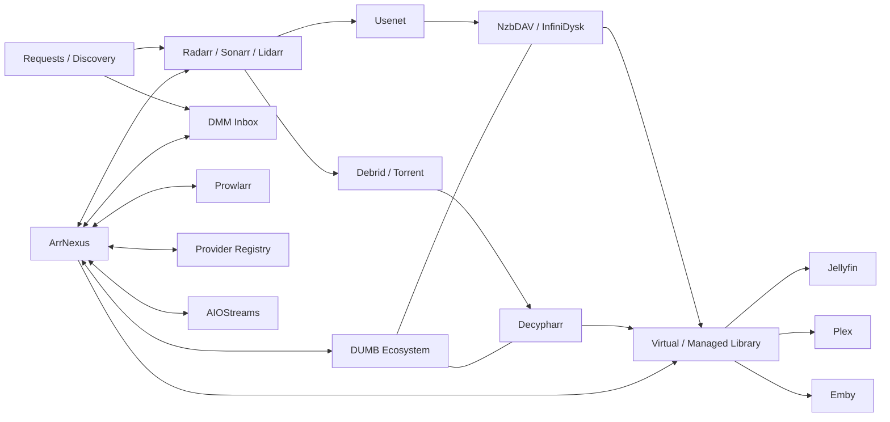

<p align="center">
  
</p>

<p align="center">
  <strong>Self-hosted control, automation and intelligence for modern Arr-based media stacks.</strong>
</p>

<p align="center">
  <a href="#-quick-start">Quick Start</a> •
  <a href="#-what-arrnexus-does">Features</a> •
  <a href="#-architecture">Architecture</a> •
  <a href="docs/USER_GUIDE.md">User Guide</a> •
  <a href="docs/DOCUMENTATION_AUDIT.md">Documentation Audit</a>
</p>

<p align="center">
  
  
  
  
</p>

> [!IMPORTANT]
> **ArrNexus does not replace Radarr, Sonarr, Lidarr, Prowlarr, DUMB, Jellyfin, Plex, Emby or your download/provider stack.** It sits above and beside them as a control plane that can see across the workflow, apply policy, coordinate routing, expose problems and make the whole stack easier to operate.

---

## ✨ What is ArrNexus?

ArrNexus began as a way to bridge **Debrid Media Manager / Real-Debrid** into an existing Arr workflow without throwing away the automation already provided by Radarr and Sonarr.

It has grown into a broader media operations layer for:

- **Discovery & acquisition** across Arr, Debrid and Usenet workflows.
- **Smart routing** by provider, media type, library, quality strategy or rule.
- **DMM Inbox** review and controlled linking into managed libraries.
- **Provider Registry** for Debrid, Usenet and related service credentials.
- **Language Guard** using real media-stream inspection rather than filename guesses.
- **Music Hub** with Lidarr and optional Spotify personal-library integration.
- **AIOStreams Bridge** with safe preview/apply/backup/rollback behaviour.
- **Library health, Self-Healing and Quality Lab** workflows.
- **Prowlarr/indexer visibility**, operational queues, jobs and unified logging.
- **Stack Readiness** checks across connected services.
- **Jellyfin integration**, plus Plex, Emby and custom media-server connection support.
- **In-app Help Centre** with setup, usage, troubleshooting and recovery guidance.

### Supported ecosystem

`Radarr` · `Sonarr` · `Lidarr` · `Prowlarr` · `Seerr` · `Jellyfin` · `Plex` · `Emby` · `DUMB` · `NzbDAV / InfiniDysk` · `Decypharr` · `DMM` · `AIOStreams` · `Spotify` · multiple Debrid/Usenet providers

---

## 🚀 What ArrNexus does

<p align="center">
  
</p>

| Area | What ArrNexus adds |
| --- | --- |
| **Discover & Acquire** | Search, compare and route movie, TV and music requests across connected services. |
| **DMM / Debrid** | Review existing Debrid media, identify titles, validate policy and link safely into Arr-managed libraries. |
| **Smart Routing** | Route by strategy, provider, specialist library or explicit rule with explainable decisions. |
| **Provider Registry** | Keep provider capability and credentials in one protected model instead of hard-coding one Debrid service. |
| **Language Guard** | Inspect actual audio/subtitle streams with `ffprobe`; unknown metadata can fail closed. |
| **Self-Healing** | Surface broken/inconsistent links and provide bounded repair workflows. |
| **Quality Lab** | Inspect release naming, file health and quality-related state. |
| **Operations** | Dashboard snapshots, queues, jobs, Stack Readiness, Problem Centre and Unified Logs. |
| **Music Hub** | Lidarr-backed discovery plus optional per-user Spotify OAuth and personal music views. |
| **AIOStreams** | Full-config bridge with masked preview, stale-preview protection, backup, apply, verify and rollback. |

> [!TIP]
> The full page-by-page manual lives in **[`docs/USER_GUIDE.md`](docs/USER_GUIDE.md)**. ArrNexus v9.4 also exposes the same guidance in the public `/help` centre and through the contextual `?` button inside the app.

---

## 🧠 Architecture

<p align="center">
  
</p>

A normal request can still follow the familiar path:

```text
Request
  ↓
Radarr / Sonarr / Lidarr
  ↓
Search + acquisition decision
  ↓
Usenet / Debrid / provider backend
  ↓
Virtual, linked or normal library
  ↓
Jellyfin / Plex / Emby
```

**ArrNexus sits across that flow**. It does not need to own every component to provide value.

<details>
<summary><strong>Show the live Mermaid architecture diagram</strong></summary>



</details>

### DUMB / mount-namespace users

> [!WARNING]
> In some DUMB deployments the useful virtual-media paths exist **inside another container/process mount namespace**, not directly on the Docker host. ArrNexus therefore intentionally supports host PID visibility and `SYS_PTRACE` so it can inspect paths through `/proc/<pid>/root/...`. Do not remove those Compose options merely because the host itself cannot see `/mnt/debrid`.

---

## ⚡ Quick Start

<p align="center">
  
</p>

### Fast path — Git + Docker Compose

```bash
git clone https://github.com/Fudmonk95/ArrNexus.git arrnexus
cd arrnexus
mkdir -p data
docker compose up -d --build
```

Then open:

```text
http://<ARRNEXUS_HOST>:8484
```

Complete first-run setup, create the administrator account and connect only the services you actually use.

> [!NOTE]
> ArrNexus stores normal runtime state under `./data`. **Do not commit that directory.**

<details>
<summary><strong>Recommended: validate the source before Docker build</strong></summary>

On Debian/Ubuntu:

```bash
sudo apt update
sudo apt install -y python3-venv

python3 -m venv .venv
source .venv/bin/activate
python -m pip install --upgrade pip
python -m pip install -r requirements.txt
python validate.py
deactivate
```

A successful v9.4 release ends with the retained regression chain passing through v7 → v8 → v9 → v9.1 → v9.2 → v9.3 → v9.4.

</details>

---

## 📦 Installation options

GitHub supports collapsible sections, so the detailed install methods are below without turning the front page into a 20-minute scroll.

<details>
<summary><strong>1 — Git clone + Docker Compose</strong></summary>

### Requirements

- Linux host or VM with Docker + Docker Compose plugin
- network access from the ArrNexus container to whichever applications you connect
- optional `python3-venv` for host-side validation

### Install

```bash
git clone https://github.com/Fudmonk95/ArrNexus.git arrnexus
cd arrnexus
mkdir -p data

docker compose config
docker compose up -d --build
```

Check the container:

```bash
docker compose ps
docker compose logs --tail=200 arrnexus
curl -fsS http://127.0.0.1:8484/api/health
```

Open:

```text
http://<ARRNEXUS_HOST>:8484
```

</details>

<details>
<summary><strong>2 — Release ZIP + Docker Compose</strong></summary>

Download a release ZIP, extract it into its own directory, then:

```bash
cd arrnexus-vX.Y
mkdir -p data

docker compose config
docker compose up -d --build
```

For beta testing, keeping separate version directories makes rollback simple:

```text
arrnexus-v9.3/
arrnexus-v9.4/
```

Copy only the previous version's persistent `data/` into the new release when upgrading.

</details>

<details>
<summary><strong>3 — Portainer Git Stack</strong></summary>

In Portainer:

1. Open **Stacks → Add stack**.
2. Choose **Git repository**.
3. Repository URL:

   ```text
   https://github.com/Fudmonk95/ArrNexus.git
   ```

4. Repository reference:

   ```text
   refs/heads/main
   ```

5. Compose path:

   ```text
   docker-compose.yml
   ```

6. Deploy the stack.
7. Keep the mapped `data` directory persistent across redeployments.

</details>

<details>
<summary><strong>4 — Portainer Web Editor / stack file</strong></summary>

You can paste the included `docker-compose.yml` into Portainer's Web Editor and deploy it directly.

The current source release builds locally from the repository/source tree. A future official GHCR image will make Web Editor deployments even simpler.

</details>

<details>
<summary><strong>5 — Future GHCR image</strong></summary>

An official pre-built image is planned, but **is not being claimed as published yet**.

When it exists, the intended flow is:

```yaml
services:
  arrnexus:
    image: ghcr.io/fudmonk95/arrnexus:latest
    container_name: arrnexus
    restart: unless-stopped
    pid: host
    cap_add:
      - SYS_PTRACE
    extra_hosts:
      - "host.docker.internal:host-gateway"
    ports:
      - "8484:8000"
    volumes:
      - ./data:/data
```

Until an official image is published from this repository, use the source/Compose methods above.

</details>

---

## 🔌 Connections & providers

ArrNexus is intentionally modular. You can install it first and add integrations later.

<details>
<summary><strong>Arr applications</strong></summary>

Configure these from **Connections** using a URL reachable **from inside the ArrNexus container** plus the service's API key:

| Service | Typical purpose |
| --- | --- |
| Radarr | Movie management, roots, profiles, searches and imports |
| Sonarr | TV/season/episode state and searches |
| Lidarr | Music library/acquisition |
| Prowlarr | Indexer visibility and supported controls |
| Seerr | Request/discovery context |

Do not blindly use `localhost`; inside the ArrNexus container it refers to ArrNexus itself.

</details>

<details>
<summary><strong>Media servers — Jellyfin, Plex, Emby and custom</strong></summary>

- **Jellyfin** — deepest current media-server integration.
- **Plex** — URL + `X-Plex-Token` connection/health foundation.
- **Emby** — URL + API key connection/health foundation.
- **Custom media server** — URL, health/API path and optional bearer/header/query authentication.

Plex/Emby support is intentionally described as a connection foundation rather than pretending they already expose every Jellyfin-specific feature.

</details>

<details>
<summary><strong>Debrid / Usenet providers</strong></summary>

The Provider Registry allows ArrNexus to model multiple providers rather than hard-code the application around one Real-Debrid account.

Supported provider identities include services such as Real-Debrid, TorBox, Premiumize, AllDebrid, Debrid-Link, EasyDebrid, Easynews, NzbDAV and others used by the current ecosystem.

Secrets are masked in the UI. Existing AIOStreams credentials are preserved rather than blindly overwritten during bridge configuration.

</details>

<details>
<summary><strong>DUMB, NzbDAV / InfiniDysk and Decypharr</strong></summary>

These are optional integrations used by the reference virtual-media environment.

- **DUMB** — ecosystem/process/mount awareness.
- **NzbDAV / InfiniDysk** — Usenet-backed virtual media plus queue/history/telemetry where available.
- **Decypharr** — Debrid/torrent-side acquisition and virtual-media integration.

ArrNexus does not replace any of them; it adds higher-level visibility and workflows across them.

</details>

---

## 🎵 Music & Spotify

Music is treated as a first-class workflow rather than being squeezed into the movie/TV interface.

ArrNexus can expose Lidarr-backed music discovery plus optional Spotify catalogue/personal-library features.

<details>
<summary><strong>Spotify setup — important OAuth steps</strong></summary>

Spotify application credentials and a user's Spotify account link are **two separate things**.

1. Open **Music API Settings** in ArrNexus.
2. Enter your Spotify application **Client ID** and **Client Secret**.
3. Copy the callback URI displayed by ArrNexus.
4. Add that **exact** URI to the Redirect URIs in your Spotify Developer application.
5. Save the Spotify application settings.
6. If your Spotify app is in Development Mode, make sure the Spotify user is allowed by the developer application's current user-access rules.
7. Return to **Music Hub** and click **Connect Spotify** for the ArrNexus user.

A public ArrNexus deployment will normally use a callback shaped like:

```text
https://<YOUR_PUBLIC_ARRNEXUS_HOST>/music/spotify/callback
```

ArrNexus v9.4 can derive public links from the configured **Public ArrNexus URL** or standard forwarded reverse-proxy headers.

Common symptoms:

- **Invalid redirect URI** → callback differs between Spotify and ArrNexus.
- **App ready, account not linked** → credentials work; user OAuth has not been completed.
- **403 after successful login** → check Spotify developer-app user access / Development Mode rules.

See the full **[Music & Spotify guide](docs/USER_GUIDE.md)** or `/help?topic=spotify` in a running ArrNexus instance.

</details>

---

## 🛡️ Safety model

ArrNexus touches systems that can contain powerful credentials and valuable media state, so destructive behaviour is deliberately bounded.

- Secrets are stored as protected settings and rendered back masked.
- `/data`, databases, `.env`, tokens and runtime backups must never be committed.
- DMM/Language Guard rejection does **not** automatically delete underlying Debrid source media.
- Undo operations target ArrNexus-created links rather than source content.
- AIOStreams apply uses preview → digest check → backup → full write → verification.
- Community connectors/providers are data-driven rather than arbitrary third-party Python execution.
- Public source ZIP generation excludes persistent/runtime data.

See **[`SECURITY.md`](SECURITY.md)** for the repository security rules.

---

## 🧰 Help, diagnostics & troubleshooting

ArrNexus v9.4 includes an in-app **Help Centre** at:

```text
/help
```

and a contextual `?` button on authenticated pages.

<details>
<summary><strong>Connection fails even though the URL works in my browser</strong></summary>

Check the URL **from the ArrNexus container**, not from your desktop browser.

```bash
docker compose exec arrnexus python - <<'PY'
import urllib.request
print(urllib.request.urlopen('http://SERVICE:PORT', timeout=5).status)
PY
```

Remember that `localhost` inside ArrNexus refers to ArrNexus itself.

</details>

<details>
<summary><strong>ArrNexus page is slow</strong></summary>

v9.4 records request timing information and logs slow routes.

Open **Unified Logs** and search for:

```text
performance
slow_request
```

This tells you which route is actually expensive instead of treating every slow page as the same problem.

</details>

<details>
<summary><strong>Filesystem / virtual-media paths are missing</strong></summary>

In DUMB-style deployments, a path may exist only inside another container/process namespace. Verify the intended Docker `pid: host`, `SYS_PTRACE` and mount-namespace architecture before inventing a replacement host path.

</details>

<details>
<summary><strong>ArrNexus will not start</strong></summary>

```bash
docker compose ps
docker compose logs --tail=300 arrnexus
curl -fsS http://127.0.0.1:8484/api/health
```

If upgrading, confirm the previous release's `data/` was copied into the new release directory before startup.

</details>

---

## 🔄 Updating safely

During beta testing, separate version directories are recommended because rollback is immediate.

<details>
<summary><strong>Upgrade example</strong></summary>

```bash
# Prepare the new release first
cd /opt/arrnexus-vNEW
mkdir -p data

# Stop the old release only when ready
cd /opt/arrnexus-vOLD
docker compose down

# Preserve runtime state
cp -a /opt/arrnexus-vOLD/data/. /opt/arrnexus-vNEW/data/

# Start the new release
cd /opt/arrnexus-vNEW
docker compose config
docker compose up -d --build
```

Rollback:

```bash
cd /opt/arrnexus-vNEW
docker compose down

cd /opt/arrnexus-vOLD
docker compose up -d
```

Never replace the source tree with a copy of the previous release's `data` directory or commit that directory to Git.

</details>

For Git-based installs, once you are comfortable with a single persistent checkout:

```bash
git fetch --all --tags
git pull --ff-only origin main
docker compose up -d --build
```

---

## 📚 Documentation

| Document | Purpose |
| --- | --- |
| **[USER_GUIDE.md](docs/USER_GUIDE.md)** | Full setup, usage, troubleshooting and recovery manual |
| **[DOCUMENTATION_AUDIT.md](docs/DOCUMENTATION_AUDIT.md)** | Maps application routes/actions to their Help coverage |
| **[VALIDATION.md](VALIDATION.md)** | Release-validation record and scope |
| **[SECURITY.md](SECURITY.md)** | Secret handling and public-repository safety |
| **[CHANGELOG.md](CHANGELOG.md)** | Release history and notable changes |

The v9.4 documentation gate is designed so major user-facing pages cannot silently lose Help coverage without the release validator noticing.

---

## 🧪 Current release status

**Current release:** `v9.4.0-beta`

The package retains regression validation across the earlier release lines and adds source-backed Help/documentation coverage in v9.4.

Beta means exactly that: ArrNexus has extensive deterministic validation, but real deployments vary wildly in Docker networking, mount namespaces, provider APIs, reverse proxies and media-server layouts. Live-stack feedback is valuable.

---

## 🤝 Testing & feedback

Useful bug reports include:

- exact ArrNexus version
- deployment method
- affected page/action
- reproducible steps
- expected vs actual behaviour
- relevant **sanitised** log lines
- which integrations are enabled

Before posting screenshots/logs publicly, remove API keys, tokens, private hostnames, IP addresses, local usernames and sensitive filesystem paths.

---

<p align="center">
  <strong>ArrNexus</strong><br>
  Your Media Stack. <strong>One Control Plane.</strong>
</p>
