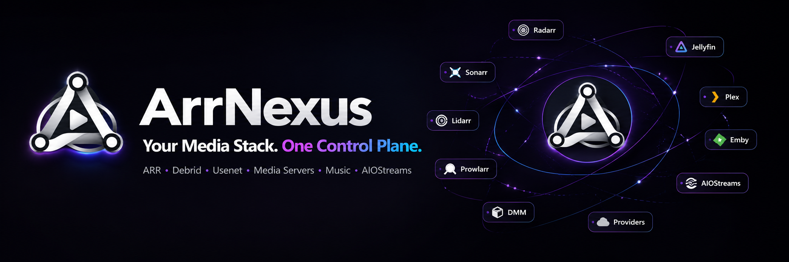
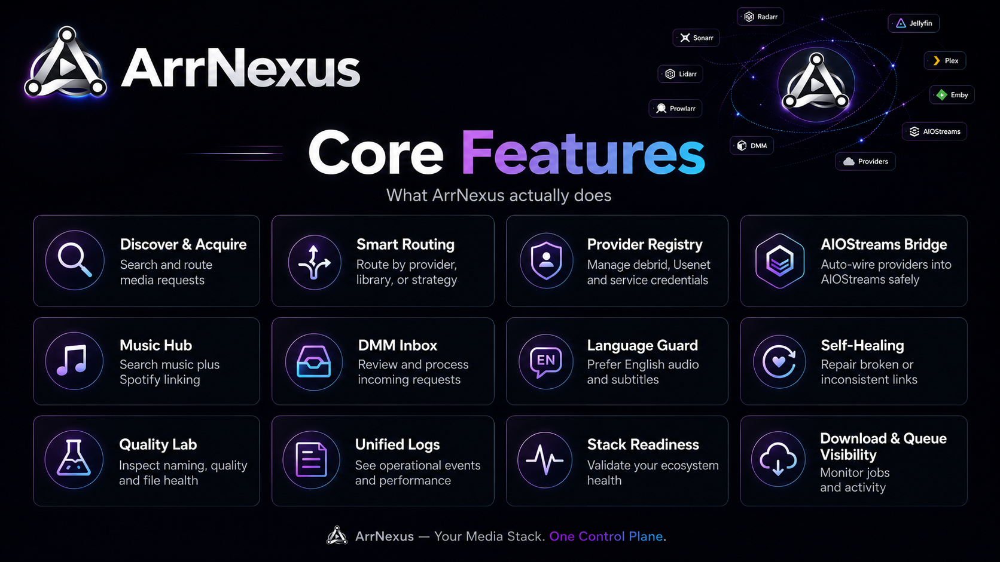
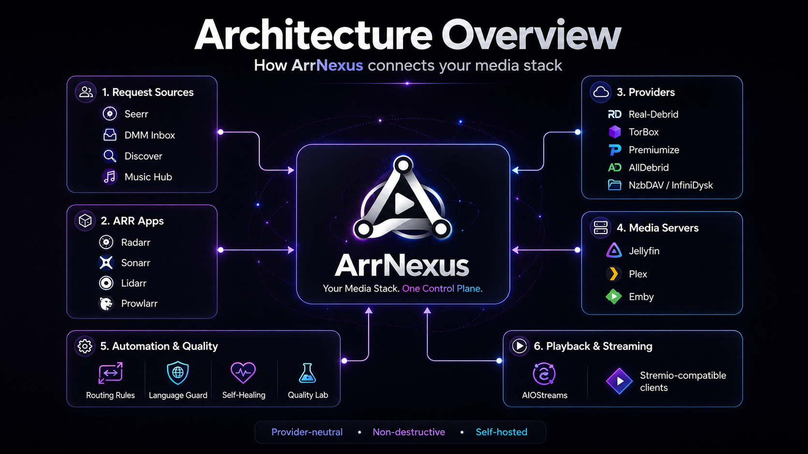
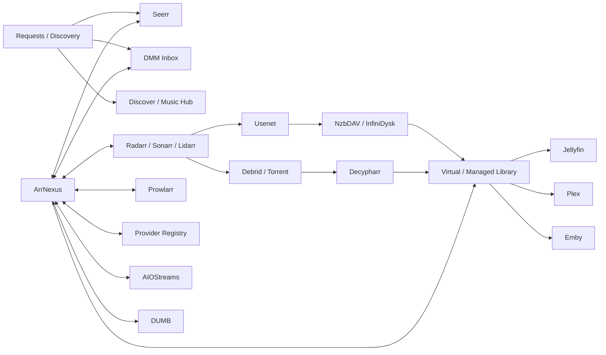
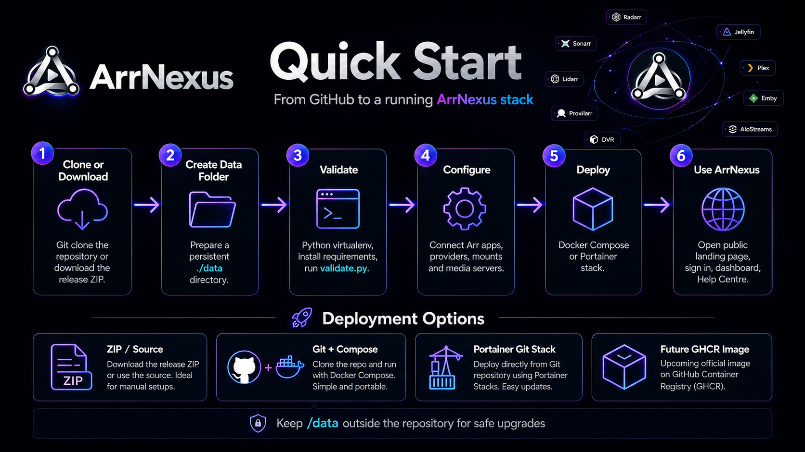

<p align="center">
  
</p>

<p align="center">
  <strong>Self-hosted control, automation and intelligence for modern Arr-based media stacks.</strong>
</p>

<p align="center">
  <a href="#-what-is-arrnexus">What is ArrNexus?</a> •
  <a href="#-core-features">Features</a> •
  <a href="#-architecture">Architecture</a> •
  <a href="#-quick-start">Quick Start</a> •
  <a href="docs/USER_GUIDE.md">Full User Guide</a> •
  <a href="docs/DOCUMENTATION_AUDIT.md">Documentation Audit</a> •
  <a href="https://github.com/Fudmonk95/ArrNexus/releases">Releases</a>
</p>

<p align="center">
  
  
  
  
  
</p>

> [!IMPORTANT]
> **ArrNexus does not replace Radarr, Sonarr, Lidarr, Prowlarr, DUMB, Jellyfin, Plex, Emby or your download/provider stack.**  
> It sits above and beside them as a control plane that can see across the workflow, apply policy, coordinate routing, expose problems and make the whole stack easier to operate.

---

## ✨ What is ArrNexus?

ArrNexus began as a way to bridge **Debrid Media Manager / Real-Debrid** into an existing Arr workflow without throwing away the automation already provided by Radarr and Sonarr.

It has grown into a wider operations layer for **discovery, external list automation, acquisition planning, provider routing, DMM imports, language validation, library health, media-server visibility, music discovery, Prowlarr control, AIOStreams/AIOMetadata visibility, diagnostics and day-to-day media operations**.

### The problem it solves

A modern media stack is powerful, but every application normally understands only its own piece:

- **Radarr** manages movies.
- **Sonarr** manages TV.
- **Lidarr** manages music.
- **Prowlarr** manages indexers.
- **Seerr** manages requests and discovery.
- **Jellyfin / Plex / Emby** serve the finished library.
- **DUMB** can coordinate virtualised media workflows.
- **NzbDAV / InfiniDysk** provide Usenet-backed virtual media and telemetry.
- **Decypharr** handles Debrid/torrent-side workflows.
- **DMM** is excellent for discovering and adding content to a Debrid account.
- **AIOStreams** consolidates stream/addon/provider configuration for compatible clients.

The missing piece is somewhere those systems can be **viewed, reasoned about and automated together**.

**That is ArrNexus.**

### Supported ecosystem

`Radarr` · `Sonarr` · `Lidarr` · `Prowlarr` · `Seerr` · `Jellyfin` · `Plex` · `Emby` · `DUMB` · `NzbDAV / InfiniDysk` · `Decypharr` · `DMM` · `AIOStreams` · `Spotify` · multiple Debrid/Usenet providers

---

## 🛟 Version 10.5.0 — Recovery Control & Reliable Imports

v10.5.0 is the field-reliability release for damaged/cloud-backed TV packs. It keeps the v10.4 recovery architecture but gives the operator control over language checks, long-running jobs, CRC re-tests and mixed-season imports.

- **Language Checks master switch** — turn Language Guard fully ON or OFF from the Inbox or Settings. OFF performs no import-time ffprobe language scan and stale unknown/re-check state cannot block import.
- **Cancellable jobs** — import, archive inspection/verification/extraction, local CRC staging and TV Recovery splitting cooperatively cancel. Child processes terminate first and are killed only if needed.
- **Season-aware grouped TV import** — chooses the strongest individual episode source per season/episode, imports safe seasons immediately and leaves combined/CRC-damaged seasons in recovery-required state.
- **Recovered-media import detection** — library symlinks into `/mnt/debrid/arrnexus-extracted` now count exactly like provider-source links, fixing successful recoveries that remained Waiting.
- **Superseded source packs** — inferior overlapping packs are shown as covered by the preferred source rather than hijacking grouped imports. Provider media is never deleted implicitly.
- **Local CRC staging** — failed provider RAR members can be explicitly staged to the recovery disk and re-verified. A local pass is classified as a virtual/provider read-path issue; a repeated failure stays CRC-damaged.

The logical recovery root remains `/mnt/debrid/arrnexus-extracted`; `.arrnexus-originals` remains excluded from Inbox/import scans.

## 🧠 Version 10.4.4 — Unified Recovery & TV Intelligence

v10.4.4 joins archived-media recovery back into the normal DMM Inbox and makes TV recovery use real series metadata instead of trusting filenames alone.

### Background large-archive inspection

- RAR **Inspect** is now a background job. Large cloud-backed archives such as 100+ GB Power Rangers sources no longer hold an HTTP request open until Cloudflare returns a 524.
- Completed catalogues are cached by the stable archive fingerprint/catalogue signature and reopened instantly until the archive actually changes.
- Background inspection allows up to 30 minutes for very large virtual archives while the browser remains responsive.

### Recovered packs are first-class Inbox sources

- `/mnt/debrid/arrnexus-extracted` is scanned alongside the normal DMM/provider source root.
- Each top-level recovered folder counts as **one source pack**, even when it contains many episode files or generated `Season XX` folders.
- Recovered source identity is propagated from the TMDb-tagged archive, so separate Tracy Beaker Season 1/2/3 recoveries merge with existing Season 4/5 provider packs on one series card.
- Source-pack detail shows provenance (`RAR recovered` versus `DMM/provider`) and unioned season coverage.

### Runtime-aware joined episode detection

- Multi-episode names such as `S03E06-7`, `S03E06-E07`, `S03E06E07` and `3x06-07` retain the full range instead of collapsing to E06.
- Sonarr remains the preferred season episode-count source. TMDb is the fallback when Sonarr does not yet own the show, and TMDb episode runtimes provide an additional sanity check.
- A file named as one episode can still be flagged for recovery review when its actual `ffprobe` runtime is approximately 2×/3× the normal episode runtime.
- Combined-season files use Sonarr/TMDb episode counts to build explicit runtime estimates when no chapters exist; runtime estimates always require administrator confirmation.
- TV import now runs the recovery analysis as a safety gate before Sonarr import, preventing joined/combined media from silently entering the library as one episode.

### One recovered-media storage model

- Generated split episodes stay under the DUMB-visible recovered-media tree.
- After a recovered combined/joined file is successfully split, the original recovered copy is retained under `.arrnexus-originals` and excluded from future Inbox/import scans; the original provider RAR is also retained.
- Canonical naming preserves multi-episode ranges before splitting.

## 🛠️ Version 10.4.3 — Recovery Pipeline & Language Inbox Hotfix

v10.4.3 finishes the field fixes uncovered while recovering *The Queen's Nose* and re-checking older DMM Language Guard results.

### Independent RAR member verification

- Every recognised video member is tested in its own 7-Zip/unrar invocation. A CRC-broken `Season 1.mp4` can no longer terminate the test before recoverable Seasons 2-7 are independently verified.
- Verification jobs report live per-member progress and retain verified/failed/unverified state for selective recovery.
- Only verified video files remain eligible for extraction; metadata, artwork, torrent padding and nested archives stay excluded.

### One recovered-media storage model

- Advanced TV Recovery no longer defaults to `/data/split-cache`.
- Split episode outputs are written to the DUMB-visible recovered-media source root (default `/mnt/debrid/arrnexus-extracted`).
- If a combined-season file came from RAR recovery, generated `Season XX` episode folders are created beside that recovered source. Sonarr/Radarr libraries continue to receive symlinks rather than duplicate media bytes.

### Language Guard/InBox correctness

- The Language view is now built from unresolved source copies before duplicate-title grouping. A source that passes its current-policy re-check disappears from Language immediately.
- A source containing any unknown/unlabelled/probe-failed media is **Manual Review**, even if another member has an explicit non-English tag. Uncertainty can no longer be promoted to a confirmed/destructive rejection.
- The Language Guard cache namespace is bumped again so affected Bernard's Watch-style results are forced through the corrected source-level evaluator.

## 🛠️ Version 10.4.2 — Stable Archive Identity Hotfix

v10.4.2 fixes false **RAR source changed after preview** failures seen on Decypharr/DUMB virtual mounts. v10.4.1 used the `/proc/<pid>/root/...` view path and file modification time as part of the archive fingerprint; both can legitimately change while the underlying provider archive is unchanged.

### Stable recovery safety

- Archive source identity now uses the logical DMM path plus provider-visible size, never the transient `/proc` PID or virtual `mtime`.
- Media verification re-lists the archive after the potentially long test and compares a content catalogue signature built from member paths, listed sizes, encryption state and CRC metadata.
- Extraction performs a fresh catalogue check against the verification result, so a real archive/member change still fails closed even when total file size is unchanged.
- TMDb archive identities created on v10.4/v10.4.1 are migrated to the stable v10.4.2 source identity when possible.

### Field-import correctness

- Language Guard cache decisions are versioned again so pre-fix false rejections cannot survive an upgrade. Undefined/unknown audio metadata is re-evaluated as **Manual Review**, never a confirmed rejection.
- Import jobs now report **Manual Review** separately from **Language rejected**; uncertain media no longer inflates the rejection counter.
- Radarr/Sonarr imports perform an external-ID ownership check before adding a title. A movie already present by TMDb ID (or series by TVDB ID) is reused instead of surfacing normal `MovieExistsValidator`/duplicate-path responses as a failed import.
- v10.4.2 introduces no new Docker/OS dependency; installations already rebuilt for v10.4 RAR support can use the normal browser updater.

## 🛠️ Version 10.4.1 — Selective RAR Recovery Hotfix

v10.4.1 hardens Archived Media Recovery using the real-world Queen's Nose archive failure found during field testing. A damaged member no longer condemns every good video in the RAR, and support/padding files are never extracted by the normal recovery path.

### Media-only recovery

- Archive inspection hides torrent padding and separates video members from XML, SQLite, artwork, nested archives and other support files.
- Verification runs as a background job and tests only recognised video members.
- Recovery is per-file: verified members can be recovered even when the archive itself reports structural warnings/errors.
- Failed CRC/data-error members are disabled and cannot be selected for recovery.
- Administrators choose exactly which verified video files to recover.
- Each produced file must match the archive-listed size when available and pass `ffprobe` with a real video stream before ArrNexus commits it to persistent recovery storage.
- The original provider RAR is always retained.

### Faster, clearer inspection

- A useful RAR catalogue is preserved even when 7-Zip exits non-zero but can still enumerate safe media members.
- Successful/partial listings are cached by exact source fingerprint, so reopening the same archive does not repeatedly re-read cloud-backed headers.
- 7-Zip warnings/errors are shown separately from the media list instead of dumping raw padding records into a red exception banner.
- The recovery-root wording now makes clear that it is the persistent source for recovered video bytes; Sonarr/Radarr library symlinks point back to it.

## 🆕 Version 10.4 — Archived Media Recovery, Identity Resolution & Language Safety

v10.4 is a field-driven recovery release for the real cases v10.3 exposed: old English media with missing stream-language tags, TV seasons arriving as separate provider packs, RAR-packed Debrid media that never appears in the normal DMM video scan, and archive names too generic to identify safely.

### Archived Media Recovery

- Scan the DMM `__all__` tree for RAR and multipart RAR sets independently of the normal video scanner.
- Review archive contents, volume count, classification, estimated output size and storage headroom before extraction.
- Nothing is unpacked automatically. Passworded, unsafe, nested-only and non-media archives remain review-only.
- Extract reviewed media to a DUMB-visible recovery root (default `/mnt/debrid/arrnexus-extracted`) so recovered files can be symlinked into Sonarr/Radarr libraries.
- The original provider archive is retained.

### TMDb identity & naming

- Configure a product-wide TMDb API key from Archived Media Recovery.
- Resolve ambiguous names such as `season-4_202405.rar` to the exact movie/TV identity before extraction.
- Identity choices are bound to the exact source fingerprint.
- Item Review includes a **Review naming & import** dialog for correcting title, type and year before import.
- ArrNexus previews canonical filenames and sends the resolved identity into the real Radarr/Sonarr match/import path.

### Language Guard safety

- `und`, blank, mixed and unknown audio metadata is now **Manual review**, not proof that media is non-English.
- Explicit non-English metadata with no English track remains a confirmed rejection.
- Administrators can mark a known old encode as English for that exact source fingerprint.
- Manual/unknown results can never authorize provider deletion.

### Series-first DMM TV

Multiple provider folders for the same show now collapse under one TV series card with season/source-pack detail instead of appearing as unrelated shows merely because their release folders use different years.

> [!IMPORTANT]
> RAR inspection/extraction adds an OS-level 7zip dependency. Native application update can install the v10.4 code, but an existing v10.3 container image must be rebuilt/redeployed once before Archived Media Recovery can actually inspect/extract RAR files.

## 🆕 Version 10.3 — Archive Rescue & Advanced Media Recovery

v10.3 closes several real-world DMM/TV recovery gaps and adds an Archive.org fallback path for media that normal indexers cannot find.

### Archive Rescue

- Scan all discovered Sonarr instances for monitored missing media.
- Search Internet Archive through the existing Prowlarr integration.
- Inspect the actual `.torrent` file manifest before acquisition.
- Select only the files you need, then send the torrent directly to Real-Debrid.
- Fail closed if selected paths cannot be mapped exactly to the newly-added RD torrent.

### Advanced TV Recovery

- Recognises archive-style names such as `Season 6 episode 1`, `Series 1` and `Season 1 Complete`.
- Manual destinations are typed (`tv:bbc`, `tv:kids`, `movie:default`, etc.), so an explicit TV choice cannot be rejected as a movie route.
- Detects one-file combined seasons and redirects them to a dedicated recovery workflow.
- Uses exact chapter counts for high-confidence splits; runtime-estimated boundaries require explicit confirmation.
- Uses FFmpeg stream copy where possible, verifies outputs with ffprobe and always retains the original source.

### DMM Language workflow

- Check selected languages, Check all unchecked and Force re-check all from DMM Inbox.
- Old-policy results display **Re-check required** rather than the misleading Language unchecked.
- Confirmed rejected RD sources can be removed directly or in bulk only after current-policy, fingerprint, surviving-link and exact-provider checks pass.

### Trakt Device OAuth

The normal Trakt connection flow now uses a device code. Trakt application credentials remain available under an explicit Advanced section because Trakt still requires an application-level Client ID/Secret underneath user authorization.

### Dark / Light appearance rebuild

Dark and Light now use product-wide neutral surface and typography tokens. Light mode uses dark text throughout the shell, cards, tables, controls and operational panels; historical navy/blue component surfaces are neutralised rather than merely covered by another partial theme. Purple/cyan remain restrained ArrNexus accents.

---

## 🆕 Version 10.2 — Lists, safer cleanup & true Dark/Light

v10.2 turns external lists into first-class ArrNexus automation inputs while tightening destructive-cleanup rules and finishing the product-wide visual system.

### Lists & Watchlists

Open **Library & Automation → Lists & Watchlists** to create preview-first automations from:

- Trakt Watchlist and personal/public Trakt lists through OAuth
- IMDb public lists
- TMDb lists
- Plex Watchlist
- Simkl account watch state
- RSS / Atom
- Custom JSON feeds

Each definition chooses movie/TV/mixed handling, a specialist Radarr/Sonarr destination and the existing ArrNexus acquisition strategy. Preview separates **existing**, **already requested**, **would add** and **unmatched** titles. Existing media is never silently moved merely because another list contains it.

### Language Guard v2

English audio is the blocking default; English subtitles are optional by default. A confirmed non-English result can follow the exact provider-cleanup policy, but an `ffprobe` error or unknown stream-language result becomes **Manual review** and is never destructive. Item Review retains the explicit recheck action and persisted result.

### Provider Duplicate Cleanup

Maintenance now exposes a separate dependency-protected cleanup preview. ArrNexus can remove redundant managed symlinks, exact eligible Real-Debrid sources, or both. Provider deletion is refused while any surviving managed link still depends on that source and the preview digest must still match.

### AIOMetadata & appearance

AIOMetadata has a managed health/configuration page with masked per-user config visibility and AIOStreams relationship checks. The historical theme gallery is physically removed: ArrNexus now has exactly **Dark** and **Light** appearances with a permanent top-right toggle, Dark as the default, and a true white/black inverted Light surface. Providers and Libraries are collapsed by default for summary-first navigation.

---

## 🆕 Version 10.1 — Language cleanup & Library Consolidation

v10.1 is the first release intended to prove the v10 one-click updater end-to-end. It also tightens the DMM/Real-Debrid lifecycle and adds preview-first duplicate-link cleanup.

### Language Guard rejection is now a controlled workflow

When a DMM/Real-Debrid source fails Language Guard, ArrNexus now distinguishes that expected policy rejection from a real application/import error:

```text
Language Guard check
  ↓
PASS → create managed symlink normally

FAIL / probe failure
  ↓
block library link
  ↓
record checked/rejected state
  ↓
queue English replacement in Radarr/Sonarr (when enabled)
  ↓
exact-match rejected Real-Debrid torrent cleanup (when enabled)
```

Rejected-source deletion is deliberately fail-safe. ArrNexus does **not** fuzzy-match a title and delete whatever looks close. The DMM source-folder name must resolve to one exact Real-Debrid torrent identity; ambiguous or missing matches are retained and the job explains why cleanup did not run.

The DMM Inbox is invalidated immediately after the check/import result, so a source that has actually been checked no longer falls back to the stale `Language unchecked` / `waiting` presentation. Probe failures display as **Language check failed** and policy failures display as **Language rejected**.

### Library Consolidation

Open **Maintenance → Library Consolidation** to scan all managed Radarr/Sonarr symlinks. ArrNexus only performs expensive language/quality scoring for groups that are actually duplicates.

For each duplicate movie part or TV episode, candidates are ranked using:

1. Language Guard eligibility
2. Resolution
3. source quality such as Remux / BluRay / WEB-DL
4. HDR / Dolby Vision hints
5. codec
6. audio quality hints
7. file size

Eligibility wins before raw resolution: a verified-English 1080p source can outrank a 2160p source that failed Language Guard. Multi-part movie files are kept as separate parts, and TV consolidation groups at episode identity rather than deleting whole season/series sources blindly.

The workflow is preview-first:

```text
scan every movie/TV symlink
  ↓
group equivalent versions
  ↓
rank and show KEEP / REMOVE LINK
  ↓
preview digest
  ↓
Apply safe link cleanup
  ↓
rescan affected Radarr/Sonarr items
  ↓
rebuild source → surviving-link index
  ↓
optionally remove only exact RD sources made unreferenced by that apply
```

Provider deletion after consolidation is **off by default**. Even when explicitly enabled, only sources made unreferenced by that exact cleanup operation are considered, and ambiguous Real-Debrid matches are never deleted.

---

## 🆕 Version 10 — ArrNexus updates itself

Version 10 introduces a new application bootstrap and persistent runtime layout so normal future ArrNexus application releases can be installed **from inside ArrNexus itself**.

After the one-time normal Docker upgrade to v10:

```text
GitHub Release detected
  ↓
Update notification inside ArrNexus
  ↓
Download release ZIP + SHA-256
  ↓
Transaction-safe SQLite backup
  ↓
Safe extraction + dependency isolation
  ↓
Full retained validator chain
  ↓
Stage release under /data/runtime/releases
  ↓
Automatic restart and health verification
  ↓
Browser reloads into the new version
```

No Docker socket, Watchtower or Portainer API is required for ordinary v10+ application updates. The live database and configuration remain under persistent `/data`, while each application runtime is staged separately. If a newly activated runtime cannot become healthy, the bootstrap can return to the previous staged release automatically.

> [!IMPORTANT]
> A future release that changes the **base container image, OS packages or bootstrap itself** can explicitly require a normal Docker rebuild. ArrNexus will not bypass that safety boundary.

### Cleaner Connections & Ecosystem

Connections and Ecosystem use collapsed service rows by default. Every supported integration remains present, including disabled services, but URL/API-key/advanced configuration appears only when that service is opened. This keeps large mixed stacks readable and avoids giant unused configuration panels.

### Product-wide v10 visual system

The authenticated UI now follows the same ArrNexus identity as this GitHub page: near-black surfaces, white typography, restrained grey structure and purple/cyan accents. Legacy blue/navy card styling is overridden across the product rather than surviving on older pages.

---

## 🚀 Core Features

<p align="center">
  
</p>

| Area | What ArrNexus adds |
| --- | --- |
| **Discover & Acquire** | Search, compare and route movie, TV and music requests across connected services. |
| **DMM / Debrid Inbox** | Review existing Debrid media, identify titles, validate policy and link safely into Arr-managed libraries. |
| **Smart Routing** | Route by strategy, provider, specialist library or explicit rule with explainable decisions. |
| **Provider Registry** | Keep provider capability and credentials in one protected model instead of hard-coding one Debrid provider. |
| **Language Guard** | Inspect actual audio/subtitle streams with `ffprobe`; unknown metadata can fail closed. |
| **Self-Healing** | Detect broken/inconsistent links and provide bounded repair workflows. |
| **Quality Lab** | Inspect release naming, quality and file-health information with explainable scoring. |
| **Operations** | Dashboard snapshots, queues, jobs, Stack Readiness, Problem Centre and Unified Logs. |
| **Music Hub** | Lidarr-backed discovery plus optional per-user Spotify OAuth and personal music views. |
| **AIOStreams Bridge** | Masked preview, stale-preview protection, backup, apply, verification and rollback. |
| **Media Servers** | Deep Jellyfin support plus Plex, Emby and custom external media-server connection foundations. |
| **Help Centre** | Source-backed setup, usage, troubleshooting and recovery guidance for the major application routes. |

> [!TIP]
> This README is the **product front page**. The complete page-by-page manual lives in **[`docs/USER_GUIDE.md`](docs/USER_GUIDE.md)** and is also available from ArrNexus itself at `/help`.

---

## 🧠 Architecture

<p align="center">
  
</p>

A normal request can still follow the familiar path:

```text
Request
  ↓
Radarr / Sonarr / Lidarr
  ↓
Search + acquisition decision
  ↓
Usenet / Debrid / provider backend
  ↓
Virtual, linked or normal library
  ↓
Jellyfin / Plex / Emby
```

**ArrNexus sits across that flow.** It adds intelligence and visibility without having to own the specialist applications underneath it.

<details>
<summary><strong>▶ Open the live Mermaid architecture diagram</strong></summary>



</details>

<details>
<summary><strong>▶ DUMB / mount-namespace architecture</strong></summary>

Some DUMB/Arr deployments expose useful virtual-media paths **inside another container/process mount namespace** even when the Docker host itself cannot see the same path.

ArrNexus can follow the live Arr/DUMB namespace through:

```text
/proc/<ARR_PID>/root/<logical-media-path>
```

That is why the recommended Compose keeps:

```yaml
pid: host

cap_add:
  - SYS_PTRACE
```

Do not remove those options just because the host itself cannot see a path such as `/mnt/debrid`.

Three concepts must stay separate:

1. **Source content** — underlying Usenet/Debrid-backed source.
2. **Virtual/cache layer** — NzbDAV/Decypharr/DUMB exposure.
3. **Managed library** — paths consumed by Radarr, Sonarr, Lidarr and media servers.

ArrNexus reasons about the relationship instead of blindly moving source content.

</details>

---

## ⚡ Quick Start

<p align="center">
  
</p>

### Fast path — Git + Docker Compose

```bash
git clone https://github.com/Fudmonk95/ArrNexus.git arrnexus
cd arrnexus

mkdir -p data

docker compose config
docker compose up -d --build
```

Then open:

```text
http://<ARRNEXUS_HOST>:8484
```

Complete first-run setup, create the administrator account and connect only the services you actually use.

> [!NOTE]
> ArrNexus stores persistent runtime state under `./data`. **Never commit that directory to Git.**

<details>
<summary><strong>▶ Recommended host-side validator before Docker build</strong></summary>

On Debian/Ubuntu:

```bash
sudo apt update
sudo apt install -y python3-venv

python3 -m venv .venv
source .venv/bin/activate

python -m pip install --upgrade pip
python -m pip install -r requirements.txt

python validate.py

deactivate
```

The `.venv` is only for host-side validation. The ArrNexus Docker image installs its own dependencies.

A successful v10 package runs the retained regression chain through:

```text
v7 → v8 → v9 → v9.1 → v9.2 → v9.3 → v9.4 → v10
```

</details>

---

## 📦 Installation & Deployment

GitHub supports native collapsible sections, so the complete install information is preserved without forcing everyone to scroll through it.

<details>
<summary><strong>▶ Method 1 — Git clone + Docker Compose</strong></summary>

### Requirements

- Linux host or VM capable of running Docker.
- Docker Engine and Docker Compose plugin.
- Network access from ArrNexus to the services you intend to connect.
- Optional `python3-venv` for host-side release validation.

### Install

```bash
git clone https://github.com/Fudmonk95/ArrNexus.git arrnexus
cd arrnexus

mkdir -p data

docker compose config
docker compose up -d --build
```

Check it:

```bash
docker compose ps
docker compose logs --tail=200 arrnexus
curl -fsS http://127.0.0.1:8484/api/health
echo
```

Then browse to:

```text
http://<ARRNEXUS_HOST>:8484
```

### Updating a Git checkout

```bash
cd arrnexus
git fetch --all --tags
git pull --ff-only origin main
docker compose up -d --build
```

Keep `data/` intact.

</details>

<details>
<summary><strong>▶ Method 2 — Release ZIP + Docker Compose</strong></summary>

This is useful when testing a specific version without depending on the current branch.

### Install host tools

```bash
sudo apt update
sudo apt install -y unzip python3-venv
```

### Extract

```bash
unzip arrnexus-v10.2.0-beta.zip
cd arrnexus-v10.2
mkdir -p data
```

### Validate

```bash
python3 -m venv .venv
source .venv/bin/activate

python -m pip install --upgrade pip
python -m pip install -r requirements.txt

python validate.py

deactivate
```

### Build and run

```bash
docker compose config
docker compose up -d --build
```

### Confirm

```bash
docker compose ps
docker compose logs --tail=200 arrnexus
curl -fsS http://127.0.0.1:8484/api/health
echo
```

During beta testing, separate version directories make rollback simple:

```text
arrnexus-v9.3/
arrnexus-v9.4/
```

Copy only the previous version's persistent `data/` into the new release when upgrading.

</details>

<details>
<summary><strong>▶ Method 3 — Portainer Git Stack</strong></summary>

For this public repository:

1. Open **Portainer → Stacks → Add stack**.
2. Name it `arrnexus`.
3. Choose **Git repository**.
4. Repository URL:

   ```text
   https://github.com/Fudmonk95/ArrNexus.git
   ```

5. Repository reference:

   ```text
   refs/heads/main
   ```

6. Compose path:

   ```text
   docker-compose.yml
   ```

7. Deploy.
8. Keep the mapped `data` directory persistent across redeployments.

Portainer clones the repository and builds the included Dockerfile.

</details>

<details>
<summary><strong>▶ Method 4 — Portainer Web Editor / stack file</strong></summary>

You can paste the repository's `docker-compose.yml` into Portainer's **Web editor** and deploy it directly.

The current public release builds from source.

When an official GHCR image exists, Web Editor deployment will no longer need to build locally.

Normal application API keys and credentials should be entered through ArrNexus — not hard-coded into a public stack definition.

</details>

<details>
<summary><strong>▶ Method 5 — Future official GHCR image</strong></summary>

An official pre-built image is planned, but **is not being claimed as published yet**.

The intended future shape is:

```yaml
services:
  arrnexus:
    image: ghcr.io/fudmonk95/arrnexus:latest
    container_name: arrnexus
    restart: unless-stopped
    pid: host

    cap_add:
      - SYS_PTRACE

    extra_hosts:
      - "host.docker.internal:host-gateway"

    ports:
      - "8484:8000"

    volumes:
      - ./data:/data
```

Then:

```bash
docker compose pull
docker compose up -d
```

Do not trust an unofficial image simply because it uses the ArrNexus name.

</details>

<details>
<summary><strong>▶ The included Compose layout and why it matters</strong></summary>

The current source Compose is intentionally simple:

```yaml
services:
  arrnexus:
    build: .
    container_name: arrnexus
    restart: unless-stopped
    pid: host

    cap_add:
      - SYS_PTRACE

    extra_hosts:
      - "host.docker.internal:host-gateway"

    ports:
      - "8484:8000"

    volumes:
      - ./data:/data
```

`./data:/data` keeps normal configuration and application state outside the source code.

`pid: host` and `SYS_PTRACE` are especially important for DUMB deployments where useful media paths may exist in an Arr/DUMB namespace rather than directly on the Docker host.

</details>

---

## 🧭 First Run

<details>
<summary><strong>▶ First-run setup flow</strong></summary>

A fresh installation opens the public ArrNexus landing page first. Private stack details are not exposed there.

The guided setup path is:

1. **Create administrator**
2. **Environment check** — Docker/PID namespace and mount awareness
3. **Connect applications**
4. **Configure providers**
5. **Review media servers**
6. **Map logical libraries/mounts**
7. **Run Stack Readiness**
8. **Finish setup and enter Dashboard**

Returning visitors can read the public About/install/help information without authentication, while private library/service details remain behind login.

</details>

<details>
<summary><strong>▶ Public URL / reverse proxy setup</strong></summary>

If ArrNexus is published through Cloudflare, Traefik, Nginx or another reverse proxy, set:

```text
Settings → General & email → Public ArrNexus URL
```

Use only the public origin, for example:

```text
https://arrnexus.example.com
```

ArrNexus can use that when generating links such as:

- Spotify OAuth callback suggestions
- password-reset email links

If it is not configured, ArrNexus can also use standard reverse-proxy headers such as:

```text
X-Forwarded-Proto
X-Forwarded-Host
```

</details>

---

## 🔌 Connections & Media Servers

ArrNexus is intentionally modular. Deploy first, then attach only the applications you actually run.

<details>
<summary><strong>▶ Radarr</strong></summary>

Used for movie management, metadata, root folders, quality context, searches and imports.

Configure in **Connections** using a Radarr URL reachable **from the ArrNexus container** plus the Radarr API key.

Typical shared-Docker-network example:

```text
http://radarr:7878
```

</details>

<details>
<summary><strong>▶ Sonarr</strong></summary>

Used for TV metadata, season/episode state, interactive release searches and import state.

Typical shared-network URL:

```text
http://sonarr:8989
```

ArrNexus uses `seriesId + seasonNumber` for real season searches rather than pretending one `seriesId` query represents a complete-series search.

</details>

<details>
<summary><strong>▶ Lidarr</strong></summary>

Used for music-library management and final music acquisition.

Typical shared-network URL:

```text
http://lidarr:8686
```

Music Hub can use Lidarr library context while acquisition continues through your normal Lidarr/Prowlarr/client workflow.

</details>

<details>
<summary><strong>▶ Prowlarr</strong></summary>

Used for indexer visibility and supported controls including:

- enabled state
- priority
- RSS
- automatic search
- interactive search
- tag/category context

> [!WARNING]
> Some DUMB-managed environments intentionally restore routing-sensitive settings. Do not blindly modify Arr tags/indexer tags simply because ArrNexus exposes them.

</details>

<details>
<summary><strong>▶ Seerr</strong></summary>

Provides request/discovery context and can be part of the normal user-request path into Radarr/Sonarr.

</details>

<details>
<summary><strong>▶ Jellyfin</strong></summary>

Jellyfin remains the deepest current media-server integration and can contribute library/search context across ArrNexus.

</details>

<details>
<summary><strong>▶ Plex</strong></summary>

ArrNexus supports a Plex server URL plus `X-Plex-Token` and verifies the Plex server endpoint.

This is currently the **connection/health foundation** for deeper Plex library support later; it is not presented as having every Jellyfin-specific feature yet.

</details>

<details>
<summary><strong>▶ Emby</strong></summary>

ArrNexus supports an Emby URL plus API key and verifies the protected system-information API.

As with Plex, this is the integration foundation for deeper library support.

</details>

<details>
<summary><strong>▶ Custom / external media server</strong></summary>

Use the custom media-server connector when another media server exposes a useful HTTP health/API endpoint.

Configure:

- name
- base URL
- health path
- authentication mode: none / bearer / header / query
- header/query name where applicable
- secret

This is a **bounded HTTP connector**, not arbitrary third-party Python execution.

</details>

<details>
<summary><strong>▶ Docker networking — the common mistake</strong></summary>

A URL that works in your desktop browser does not automatically work from inside the ArrNexus container.

If applications share a Docker network, service DNS names may work:

```text
http://radarr:7878
http://sonarr:8989
http://lidarr:8686
http://prowlarr:9696
```

If an application runs elsewhere, use a hostname or address reachable from the ArrNexus container.

Do **not** blindly use:

```text
localhost
127.0.0.1
```

Inside the ArrNexus container those refer back to ArrNexus itself.

</details>

---

## ☁️ Providers, DMM & Virtual Media

<details>
<summary><strong>▶ Provider Registry</strong></summary>

ArrNexus is no longer designed around Real-Debrid as the only possible provider.

The Provider Registry can represent services such as:

- Real-Debrid
- TorBox
- Premiumize
- AllDebrid
- Debrid-Link
- EasyDebrid
- Debrider
- Offcloud
- Put.io
- PikPak
- Seedr
- Easynews
- NzbDAV / InfiniDysk
- AltMount
- StremThru Newz
- AIOStreams
- Torrin
- other supported/manual capability definitions

Credentials are stored in persistent state and masked in the UI.

Existing provider/AIOStreams credentials should not be blindly overwritten when ArrNexus can preserve the remote value.

</details>

<details>
<summary><strong>▶ DMM / Debrid Inbox</strong></summary>

The DMM workflow is what originally drove the creation of ArrNexus.

```text
DMM / provider content
  ↓
ArrNexus identifies source
  ↓
Movie / TV match
  ↓
Route + quality + language checks
  ↓
Owning Arr item
  ↓
Managed link/import
  ↓
Media server sees a normal library result
```

Features include:

- movie/TV identification
- route suggestions
- duplicate grouping
- already-linked/imported state
- explicit bulk routing
- import jobs and failure reasons
- safe symlink mode and Undo
- broken-link scanning/repair
- orphan detection
- Quality Lab comparison
- Routing Rules
- Language Guard
- TV pack / season-pack awareness where supported

Undo focuses on ArrNexus-created links. It is **not** designed to delete the underlying Debrid/DMM source.

</details>

<details>
<summary><strong>▶ Language Guard</strong></summary>

Release filenames are not reliable proof of the streams actually inside a file.

ArrNexus includes `ffmpeg` / `ffprobe` and can inspect real media metadata before linking a DMM source into a managed library.

The default policy can require:

- English audio
- English subtitles
- fail closed when language metadata is unknown

A rejected source is **not destructively deleted**. ArrNexus can keep the source untouched and trigger a replacement/upgrade search through the owning Arr application.

</details>

<details>
<summary><strong>▶ Acquisition strategies</strong></summary>

Current strategy concepts include:

- **Automatic**
- **Debrid first → Usenet fallback**
- **Usenet first → Debrid fallback**
- **Debrid only**
- **Usenet only**
- **Fastest / cached provider preference**
- **Best quality / score**

ArrNexus plans and orchestrates; the owning Arr application still hands actual acquisition work to its configured clients.

</details>

<details>
<summary><strong>▶ DUMB / NzbDAV / InfiniDysk / Decypharr</strong></summary>

These integrations are optional and belong to the reference virtual-media environment.

- **DUMB** — ecosystem/process/mount awareness.
- **NzbDAV / InfiniDysk** — Usenet-backed virtual media plus queue/history/telemetry where available.
- **Decypharr** — Debrid/torrent-side acquisition and virtual-media integration.

ArrNexus does not replace any of them; it adds a higher-level control and observability layer.

</details>

---

## 🌐 AIOStreams Bridge

<details>
<summary><strong>▶ What the bridge does and why Apply is deliberately cautious</strong></summary>

AIOStreams is optional. Stremio is not required to use the rest of ArrNexus.

ArrNexus uses a conservative full-configuration workflow:

```text
GET current userData
  ↓
calculate digest
  ↓
masked preview
  ↓
user confirms
  ↓
GET / re-check digest
  ↓
private pre-write backup
  ↓
merge only known ArrNexus integrations
  ↓
full PUT
  ↓
verify
```

Because AIOStreams user `PUT` is a **full replacement** operation, ArrNexus preserves unrelated settings and refuses Apply when the remote configuration changed after Preview.

Rollback first backs up the current remote configuration.

Search diagnostics redact playback URLs, `Authorization`, cookies, request/proxy headers and secret-bearing values.

Provider auto-wiring is intended to fill safe missing data, not bulldoze credentials already deliberately configured in AIOStreams.

</details>

---

## 🎵 Music Hub & Spotify

Music is treated as a first-class workflow instead of being squeezed into movie/TV screens.

Possible catalogue/discovery integrations include:

- ListenBrainz
- Apple / iTunes
- Audius
- MusicBrainz
- Deezer
- Internet Archive
- Jamendo
- SoundCloud
- Spotify
- Last.fm
- external launchers such as Amazon Music, Beatport, Bandcamp and Discogs

Sources are labelled honestly; for example global ListenBrainz trends are not presented as Spotify trends.

<details>
<summary><strong>▶ Music API Settings</strong></summary>

Administrators can open:

```text
Music Hub → Music API Settings
```

The page contains application/API configuration for:

- Spotify Client ID / Client Secret
- SoundCloud Client ID / Client Secret
- Jamendo Client ID
- Last.fm API key

External catalogue URLs are validated so known placeholder/example domains are not presented as working integrations.

</details>

<details>
<summary><strong>▶ Spotify personal account setup — read this before clicking Connect Spotify</strong></summary>

Spotify **application credentials** and an individual user's **Spotify OAuth link** are two separate things.

1. Open **Music API Settings**.
2. Enter your Spotify application **Client ID** and **Client Secret**.
3. Copy the callback URI shown by ArrNexus.
4. Add that **exact** URI to the Spotify Developer application's Redirect URIs.
5. Save the Spotify developer app.
6. Satisfy Spotify's current Development Mode user/allowlist rules if applicable.
7. Return to **Music Hub**.
8. Click **Connect Spotify** for each ArrNexus user who wants personal Spotify data.

A public callback normally looks like:

```text
https://<YOUR_PUBLIC_ARRNEXUS_HOST>/music/spotify/callback
```

A linked user can expose data such as:

- saved tracks
- saved albums
- playlists
- top tracks
- top artists
- recently played

Common symptoms:

| Symptom | Likely cause |
| --- | --- |
| `Spotify app ready — account not linked` | Client credentials work, but the user OAuth step has not been completed. |
| Invalid redirect URI | Spotify and ArrNexus callback values do not match exactly. |
| Login succeeds but API returns `403` | Check the Spotify developer application's current Development Mode / user access restrictions. |
| OAuth validation fails | Start a fresh Connect Spotify flow instead of reusing an old callback URL. |

The full in-app guide is available at:

```text
/help?topic=spotify
```

Spotify's upstream developer rules can change, so verify current Spotify documentation if Development Mode behaviour differs from the guide.

</details>

---

## 🧰 Feature Guide

<details>
<summary><strong>▶ Dashboard</strong></summary>

The operational overview.

Dashboard uses a reusable snapshot rather than synchronously rescanning the entire ecosystem on every click. It can surface connected-service state, library information, active work and warnings.

</details>

<details>
<summary><strong>▶ Discover</strong></summary>

Cross-service media discovery and acquisition planning. Search results can be viewed in the context of existing Arr libraries and available acquisition routes.

</details>

<details>
<summary><strong>▶ DMM Inbox / Item Review</strong></summary>

Review provider/DMM sources, identify titles, inspect language/quality/routing state and link safely into managed libraries.

</details>

<details>
<summary><strong>▶ Download Queue / Acquisition / Timeline</strong></summary>

Operational views for active work, acquisition decisions and per-title event history across supported backends.

</details>

<details>
<summary><strong>▶ Indexers</strong></summary>

Prowlarr-backed indexer status and supported settings including enabled state, priority, RSS and search behaviour.

</details>

<details>
<summary><strong>▶ Libraries</strong></summary>

Defines and inspects logical library/mount relationships and the managed media structure ArrNexus is expected to understand.

</details>

<details>
<summary><strong>▶ Routing Rules</strong></summary>

Route different media toward default or specialist libraries/acquisition paths instead of forcing everything through one universal target.

</details>

<details>
<summary><strong>▶ Quality Lab</strong></summary>

Release/file-health scoring with explainable reasons rather than a single unexplained number.

</details>

<details>
<summary><strong>▶ Self-Healing</strong></summary>

Detect missing, broken or inconsistent states and trigger bounded remediation instead of destructive automatic changes.

</details>

<details>
<summary><strong>▶ InfiniDysk</strong></summary>

Where supported by the upstream service, ArrNexus can show health, queue/history and native overview telemetry across selectable time windows.

</details>

<details>
<summary><strong>▶ Problem Centre</strong></summary>

Turns detectable stack faults into a focused work queue instead of forcing the administrator to hunt across multiple applications.

</details>

<details>
<summary><strong>▶ Maintenance</strong></summary>

Administrative maintenance such as backups, broken-link/orphan scanning, diagnostics and safe housekeeping.

</details>

<details>
<summary><strong>▶ Stack Readiness</strong></summary>

Bounded live verification for the applications and infrastructure that matter to the current deployment.

</details>

<details>
<summary><strong>▶ Unified Logs</strong></summary>

Searchable ArrNexus events including:

```text
source: performance
event: slow_request
```

for routes that exceed the configured timing threshold.

</details>

<details>
<summary><strong>▶ Help Centre</strong></summary>

ArrNexus v9.4 exposes public help at:

```text
/help
```

Authenticated pages have a contextual `?` button that maps the current page to its relevant guide.

Help topics contain:

- what the feature does
- prerequisites
- setup
- normal usage
- what working looks like
- common failure modes
- safe recovery
- security/privacy notes where relevant

The generated source guide lives in [`docs/USER_GUIDE.md`](docs/USER_GUIDE.md).

</details>

---

## ⚡ Performance Model

<details>
<summary><strong>▶ How ArrNexus avoids doing expensive work on every click</strong></summary>

Current architecture includes:

- DUMB process-discovery caching
- DMM source inventory caching
- source → symlink index caching
- library inventory caching
- dashboard snapshots/background refresh
- stale-while-revalidate snapshots for expensive operational pages
- concurrent external API calls with short/bounded timeouts
- persistent client shell
- recently visited page cache
- request de-duplication
- intent-based prefetch
- route timing headers/logging

ArrNexus intentionally avoids silently crawling every expensive sidebar page in the background.

A slow request creates timing information such as:

```text
source: performance
event: slow_request
GET /some-route took 4200ms
```

Use the measured route to target the actual bottleneck instead of assuming the entire application needs another global cache.

</details>

---

## 🌍 Public Homepage & Release Download

<details>
<summary><strong>▶ Public vs private routes</strong></summary>

`/` is intentionally public and contains product/install/help information without exposing private library counts, paths, service URLs or credentials.

Private routes such as `/dashboard` require authentication.

A running ArrNexus instance can expose a clean source-only build at:

```text
/download/latest
/download/latest.sha256
/api/public/release
```

The exporter excludes persistent data, databases, backups, `.env`, virtualenvs, bytecode, runtime caches and existing archives.

For the public GitHub project, use the repository's **Releases** page for official downloadable release files:

https://github.com/Fudmonk95/ArrNexus/releases

</details>

---

## 🛡️ Security & Privacy

<details>
<summary><strong>▶ Security model</strong></summary>

Important rules:

- API keys, tokens and passwords are stored as protected settings and rendered back masked.
- `data/`, databases, live `.env`, OAuth tokens and runtime backups must never be committed.
- diagnostic/release exports intentionally exclude or sanitise private data.
- AIOStreams writes use preview, stale protection, backup and verification.
- Language Guard does not delete the original DMM/provider source.
- Undo focuses on ArrNexus-created links.
- custom media-server connectors are data/config-driven HTTP checks, not arbitrary Python execution.
- destructive operations should remain explicit, bounded and reviewable.

If a credential appears in UI, logs, diagnostics or release exports, treat it as a security bug.

See [`SECURITY.md`](SECURITY.md).

</details>

<details>
<summary><strong>▶ Never publish these values</strong></summary>

Do not publish:

- Arr application API keys
- Debrid/provider tokens
- DUMB, Decypharr, NzbDAV or InfiniDysk credentials
- Spotify client secrets / OAuth tokens
- webhook URLs containing secrets
- SMTP/email passwords
- live databases
- `/data`
- `.env`
- unsanitised diagnostics/logs
- local usernames / private hostnames / identifiable private deployment addresses

Use placeholders in documentation:

```text
<ARRNEXUS_HOST>
<RADARR_HOST>
<YOUR_API_KEY>
<YOUR_TOKEN>
<YOUR_MEDIA_PATH>
```

</details>

---

## 🧪 Validation

<details>
<summary><strong>▶ Host-side validation</strong></summary>

```bash
python3 -m venv .venv
source .venv/bin/activate

python -m pip install --upgrade pip
python -m pip install -r requirements.txt

python validate.py

deactivate
```

v9.4 retains historical regressions rather than replacing them:

```text
v9.4
 ↓
v9.3
 ↓
v9.2
 ↓
v9.1
 ↓
v9
 ↓
v8
 ↓
v7
```

See [`VALIDATION.md`](VALIDATION.md) for the release record.

A validator PASS does not pretend every third-party service, provider API, Docker network or mount namespace is live.

Docker image/build validation must still be run in an environment where Docker is actually available.

</details>

---

## 🩺 Troubleshooting

<details>
<summary><strong>▶ Connector fails even though the URL works in my browser</strong></summary>

Check the URL from **inside ArrNexus**, not only from your desktop.

Remember that `localhost` inside ArrNexus points back to ArrNexus itself.

Check:

1. **Connections**
2. container-reachable URL
3. API key/token
4. Docker network and DNS
5. reverse proxy
6. Unified Logs

</details>

<details>
<summary><strong>▶ A page is slow</strong></summary>

Open **Unified Logs** and search for:

```text
performance
```

or:

```text
slow_request
```

ArrNexus records the route and measured server time so the actual bottleneck can be optimised.

</details>

<details>
<summary><strong>▶ Music provider opens a wrong/placeholder page</strong></summary>

Check **Music API Settings** and any installed catalogue-provider definition.

ArrNexus rejects known example/placeholder domains, but real community/provider definitions still need valid upstream URLs.

</details>

<details>
<summary><strong>▶ Filesystem / virtual-media paths are missing</strong></summary>

In DUMB-style deployments, the path may exist only inside an Arr/DUMB process namespace.

Check the intended:

```yaml
pid: host
cap_add:
  - SYS_PTRACE
```

architecture before replacing a logical media path with an unrelated host path.

</details>

<details>
<summary><strong>▶ ArrNexus fails to start</strong></summary>

```bash
docker compose ps
docker compose logs --tail=300 arrnexus
curl -fsS http://127.0.0.1:8484/api/health
echo
```

For an upgrade, also verify the previous release's `data/` was copied into the new release directory.

</details>

<details>
<summary><strong>▶ Host validator says FastAPI is missing</strong></summary>

The Debian host Python does not have the application dependencies.

Do **not** install ArrNexus into protected system Python simply to run validation.

Use:

```bash
python3 -m venv .venv
source .venv/bin/activate
python -m pip install -r requirements.txt
python validate.py
deactivate
```

</details>

<details>
<summary><strong>▶ Spotify will not link</strong></summary>

Check:

1. Client ID / Client Secret are saved under **Music API Settings**.
2. Spotify Redirect URI exactly matches ArrNexus.
3. Public HTTPS origin is correct behind your reverse proxy.
4. Spotify developer-app Development Mode/user access restrictions are satisfied.
5. Start a fresh **Connect Spotify** flow instead of reusing an expired callback.

See `/help?topic=spotify` or the Music section above.

</details>

<details>
<summary><strong>▶ AIOStreams Apply refuses to run</strong></summary>

This can be intentional.

If AIOStreams changed after ArrNexus generated the Preview, the digest no longer matches and ArrNexus refuses to apply stale configuration.

Fetch a fresh config, create a new Preview and review the changes again.

</details>

---

## 🔄 Updating & Rollback

<details>
<summary><strong>▶ Safe ZIP upgrade</strong></summary>

During beta testing, build the new version **beside** the old version.

```bash
cd /path/to/new-arrnexus
mkdir -p data

cd /path/to/old-arrnexus
docker compose down

cp -a /path/to/old-arrnexus/data/. /path/to/new-arrnexus/data/

cd /path/to/new-arrnexus

python3 -m venv .venv
source .venv/bin/activate
python -m pip install --upgrade pip
python -m pip install -r requirements.txt
python validate.py
deactivate

docker compose config
docker compose up -d --build
```

Verify:

```bash
docker compose ps
docker compose logs --tail=200 arrnexus
curl -fsS http://127.0.0.1:8484/api/health
echo
```

Keep the old version directory until the new release has been live-tested.

Rollback:

```bash
cd /path/to/new-arrnexus
docker compose down

cd /path/to/old-arrnexus
docker compose up -d
```

</details>

<details>
<summary><strong>▶ Git-based update</strong></summary>

For a persistent Git checkout:

```bash
git fetch --all --tags
git pull --ff-only origin main
docker compose up -d --build
```

Back up persistent state before major release changes.

</details>

---

## 📚 Documentation

| Document | Purpose |
| --- | --- |
| **[USER_GUIDE.md](docs/USER_GUIDE.md)** | Full setup, usage, troubleshooting and recovery manual |
| **[DOCUMENTATION_AUDIT.md](docs/DOCUMENTATION_AUDIT.md)** | Maps application routes/actions to Help coverage |
| **[VALIDATION.md](VALIDATION.md)** | Release-validation record and scope |
| **[SECURITY.md](SECURITY.md)** | Secret handling and public-repository safety |
| **[CHANGELOG.md](CHANGELOG.md)** | Release history and notable changes |

v10 retains v9.4's documentation gate is designed so a major user-facing page cannot silently lose Help coverage without validation noticing.

---

## 🆕 What Changed in v9.4

<details>
<summary><strong>▶ Documentation & Help Centre</strong></summary>

v9.4 adds:

- public `/help`
- contextual `?` Help links inside the authenticated UI
- a source-backed Help catalogue
- generated `docs/USER_GUIDE.md`
- `docs/DOCUMENTATION_AUDIT.md`
- validation that checks major user-facing routes have Help coverage
- setup/use/success/troubleshooting structure for Help topics

</details>

<details>
<summary><strong>▶ Reverse-proxy-aware public links</strong></summary>

ArrNexus can use a configured public origin or forwarded proxy headers for externally visible links such as Spotify OAuth callbacks and password-reset emails.

</details>

<details>
<summary><strong>▶ Carried forward from v9.3 — targeted performance work</strong></summary>

The measured slow routes are treated individually instead of hiding everything behind one giant global cache:

- **DMM Inbox** uses short stale-while-revalidate snapshots and avoids per-card live media-server lookups.
- **Maintenance** parallelises filesystem/source/link/import work and reuses snapshots.
- **Problem Centre** runs namespace, broken-link and Arr health work concurrently.
- **Stack Readiness** combines base readiness with bounded live probes.
- **InfiniDysk** runs health, queue, history and overview telemetry concurrently.
- **Music Artist** overlaps Lidarr, MusicBrainz and artwork work with bounded optional external metadata.
- **Specialist Arr matching** performs independent checks concurrently.

Normal navigation retains the persistent shell, request de-duplication, visited-page cache and intent-based prefetch without silently crawling every expensive sidebar page.

</details>

<details>
<summary><strong>▶ Carried forward from v9.2 — production Dashboard fix and timing instrumentation</strong></summary>

v9.2 fixed a real upgraded-database Dashboard bug caused by attempting to deep-copy non-empty `sqlite3.Row` history objects. Rows are normalised to plain dictionaries before caching.

It also added:

```text
Server-Timing
X-ArrNexus-Elapsed-Ms
performance / slow_request logging
```

Those regressions remain covered in v9.4.

</details>

<details>
<summary><strong>▶ Music configuration and media-server expansion</strong></summary>

Recent releases added:

- dedicated **Music API Settings**
- Spotify/SoundCloud/Jamendo/Last.fm credentials
- placeholder catalogue URL rejection
- Plex server connection support
- Emby server connection support
- custom/external media-server connector
- always-visible Public Home navigation

</details>

---

## 🧪 Release Status

**Current release:** `v10.2.0-beta`

Beta means exactly that: ArrNexus has extensive deterministic validation, but real deployments vary in:

- Docker networking
- mount namespaces
- provider APIs
- reverse proxies
- media servers
- Arr configuration
- DUMB layouts
- virtual filesystems

Live-stack feedback remains valuable.

---

## 🤝 Testing & Feedback

Useful reports include:

- exact ArrNexus version
- deployment method
- enabled integrations
- affected page/action
- reproducible steps
- expected result
- actual result
- relevant **sanitised** logs
- `slow_request` timing where relevant

Before publishing screenshots or logs, remove:

- API keys
- tokens
- private hostnames
- private addresses
- local usernames
- sensitive filesystem paths

---

## 🗺️ Project Direction

ArrNexus is being developed as the layer that connects the gaps between otherwise excellent self-hosted media applications.

The goal is not to own every component.

The goal is to make the existing stack:

**easier to understand · safer to change · easier to operate together · easier to automate**

---

<p align="center">
  <strong>ArrNexus</strong><br>
  Your Media Stack. <strong>One Control Plane.</strong>
</p>

<!-- Retained release-validator compatibility markers. These phrases are intentionally hidden from rendered GitHub output.
Git clone + Docker Compose source build
Portainer Web editor / Stack file
ghcr.io/<GITHUB_OWNER>/arrnexus:latest
python3 -m venv .venv
Users Management
-->

