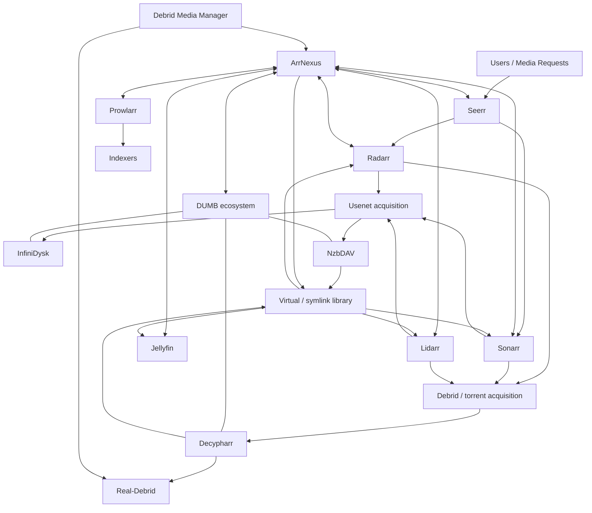

# ArrNexus

**ArrNexus is a self-hosted control, automation and intelligence layer for Arr-based media stacks.**

It is designed to sit alongside tools such as **Radarr, Sonarr, Lidarr, Prowlarr, Seerr, Jellyfin, DUMB, NzbDAV, InfiniDysk, Decypharr, Debrid Media Manager and Real-Debrid** rather than replacing them.

The original idea was simple: take a workflow that worked well manually through **Debrid Media Manager (DMM)** and make it usable as part of the same automated Arr ecosystem that already manages the rest of the media library. ArrNexus has since grown into a wider control layer for discovery, acquisition routing, DMM imports, Usenet/Debrid decisions, music discovery, library health, indexer control, diagnostics and day-to-day media operations.

> **Current release line:** ArrNexus v7.0 beta
>
> ArrNexus is currently being opened up for external testing. Expect active development, changes between beta builds and rough edges. Feedback and reproducible bug reports are very welcome.

---

## What problem does ArrNexus solve?

A modern self-hosted media stack can be extremely capable, but each application normally understands only its own part of the workflow.

- Radarr understands movies.
- Sonarr understands TV.
- Lidarr understands music.
- Prowlarr understands indexers.
- Seerr understands requests.
- DUMB provides a wider ecosystem around virtualised media workflows.
- NzbDAV provides Usenet-backed virtual media handling.
- Decypharr provides Debrid/torrent-side handling.
- InfiniDysk can provide Usenet/download telemetry and control.
- DMM is excellent for discovering and adding content to a Debrid account.
- Jellyfin consumes the finished library.

The missing piece for this project was a place where those systems could be **viewed, reasoned about and automated together**.

ArrNexus fills that gap.

It does not try to become another Radarr or another DUMB. Instead, it connects to the specialist tools already doing those jobs and adds orchestration, visibility and workflows that span more than one application.

---

## Why ArrNexus was created

ArrNexus started as a small DMM-to-Arr helper.

The development setup already had a working Arr/DUMB/NzbDAV media pipeline, but Debrid Media Manager often exposed useful cached matches and a very convenient Real-Debrid workflow. The problem was that using DMM was still largely a separate, manual process.

The original goal became:

1. Find or add something through DMM/Real-Debrid.
2. Identify what movie or TV item it belongs to.
3. Associate it with the correct Radarr or Sonarr item.
4. Route it into the existing virtual/symlink library structure.
5. Let the existing Arr applications and Jellyfin continue to behave as the source of truth for the managed library.

From there ArrNexus expanded into a broader media operations layer with discovery, acquisition strategies, smart TV pack handling, music browsing, Prowlarr control, diagnostics, Language Guard and ecosystem telemetry.

---

# Reference architecture

This is the **reference environment ArrNexus was developed around**. You do **not** need to run every component shown below in order to use ArrNexus.



## The important idea

ArrNexus is the **control layer**, not the final media server and not the downloader.

A typical request still belongs to the normal applications:

```text
Request
  -> Radarr / Sonarr / Lidarr
  -> search / acquisition decision
  -> Usenet or Debrid backend
  -> virtual / linked library
  -> Jellyfin
```

ArrNexus adds intelligence and automation around that flow. It can inspect multiple systems, compare acquisition options, work with existing DMM content, expose problems and give the administrator one place to understand what is happening.

---

# What is required and what is optional?

ArrNexus is intentionally modular. A user should not have to reproduce the entire reference environment simply to start the application.

| Component | Required? | What ArrNexus uses it for |
| --- | --- | --- |
| Docker | **Yes** for the recommended deployment | Runs ArrNexus |
| Portainer | No | Easiest Git-based stack deployment and management |
| Radarr | Optional | Movie management, movie searches, root folders, quality profiles and imports |
| Sonarr | Optional | TV management, season/episode searches and imports |
| Lidarr | Optional | Music library management and acquisition |
| Prowlarr | Optional | Indexer visibility and operational controls |
| Seerr | Optional | Request/discovery context |
| Jellyfin | Optional | Library visibility and media-server integration |
| DUMB | Optional | Integration with the wider DUMB environment |
| NzbDAV | Optional | Usenet-backed virtual media workflow |
| InfiniDysk | Optional | Usenet/download status, queue, history and telemetry |
| Decypharr | Optional | Debrid/torrent-side acquisition and virtual media workflow |
| Real-Debrid | Optional | Debrid content and cached-media workflows |
| Debrid Media Manager | Optional | DMM/Real-Debrid inbox and import workflow |
| Spotify | Optional | Personal music library and music discovery integration |

You can start ArrNexus first and add integrations afterwards from the web interface.

---

# Privacy-safe documentation convention

The public documentation deliberately contains **no private deployment values**.

You will see placeholders such as:

```text
<ARRNEXUS_HOST>
<RADARR_HOST>
<YOUR_API_KEY>
<YOUR_TOKEN>
<YOUR_MEDIA_PATH>
<YOUR_REPOSITORY_URL>
```

Replace those with values from **your own environment**.

Never publish or paste the following into GitHub issues, screenshots or configuration examples:

- API keys
- Real-Debrid tokens
- DUMB/Decypharr/InfiniDysk credentials
- Spotify client secrets
- webhook URLs containing secrets
- email passwords
- local usernames
- private hostnames
- public or private IP addresses that identify your deployment
- database files
- `.env` files containing credentials
- diagnostic bundles before checking that they are sanitised

---

# Recommended installation: Portainer Git stack

This is the intended easiest deployment method for a new user.

Portainer can pull the project directly from GitHub, build the ArrNexus image from the repository and keep the stack definition tied to the Git repository.

## Before you begin

You need:

- a Linux host or VM capable of running Docker
- Docker installed and running
- Portainer installed if you want to use the recommended deployment method
- network access from the ArrNexus container to whichever services you intend to connect

You do **not** need to create a populated `.env` file for a normal v7 deployment. Persistent ArrNexus state is stored under `/data` and application configuration is handled through the web interface.

## Step 1 - Copy the Git repository URL

On this GitHub repository page:

1. Select **Code**.
2. Select **HTTPS**.
3. Copy the repository URL.

It will end in:

```text
/ArrNexus.git
```

Do not copy a ZIP download URL for the Portainer Git deployment.

## Step 2 - Create the stack in Portainer

In Portainer:

1. Open **Stacks**.
2. Select **Add stack**.
3. Give the stack a simple name such as:

```text
arrnexus
```

4. Choose **Git repository** as the build method.
5. Paste the Git repository URL you copied from GitHub.
6. Set the repository reference to:

```text
refs/heads/main
```

7. Set the Compose path to:

```text
docker-compose.yml
```

8. Because the repository is public, repository authentication should not normally be required.
9. Deploy the stack.

Portainer will clone the Git repository and use the included Docker/Compose files to build ArrNexus.

> The first v7 build can take longer than older versions because the image includes `ffmpeg`/`ffprobe` support used by Language Guard.

## Step 3 - Confirm the container started

In Portainer open:

**Containers -> arrnexus**

The container should be running and eventually report healthy.

The default public mapping used by the project is:

```text
8484 -> 8000
```

So the first-run web interface will normally be available at:

```text
http://<ARRNEXUS_HOST>:8484
```

`<ARRNEXUS_HOST>` means the hostname or address of **your Docker server**.

## Step 4 - Complete first-run setup

On the first visit ArrNexus presents its setup flow.

Create the first administrator account and sign in.

Do not reuse credentials from another application. ArrNexus authentication is independent of Radarr, Sonarr, DUMB and the other connected services.

## Step 5 - Open Connections

Go to:

**ArrNexus -> Connections**

Add only the services you actually use.

You can return later and add more integrations without rebuilding the container.

---

# Alternative installation: Docker Compose CLI

If you do not use Portainer, clone the repository onto the Docker host and build it with Docker Compose.

```bash
git clone <YOUR_REPOSITORY_URL> arrnexus
cd arrnexus
docker compose up -d --build
```

Then open:

```text
http://<ARRNEXUS_HOST>:8484
```

To inspect the service:

```bash
docker compose ps
docker compose logs --tail=200 arrnexus
```

To update a Git-based installation later:

```bash
cd arrnexus
git pull --ff-only
docker compose up -d --build
```

Persistent application data should remain in the mapped `data` directory and must not be deleted during a normal update.

---

# Docker networking: the part that catches most new users

A URL that works in your browser does not automatically mean it works from inside the ArrNexus container.

## If services share a Docker network

A service can normally be addressed using its Docker service/container DNS name, for example:

```text
http://radarr:7878
http://sonarr:8989
http://lidarr:8686
http://prowlarr:9696
```

Those are examples only. Use the actual service names in your Docker environment.

## If a service runs elsewhere

Use a hostname that the ArrNexus container can route to:

```text
http://<RADARR_HOST>:7878
```

or a reverse-proxy URL such as:

```text
https://radarr.example.invalid
```

## Do not blindly use localhost

Inside the ArrNexus container:

```text
localhost
127.0.0.1
```

refer to the **ArrNexus container itself**.

If Radarr runs in another container or on another host, `http://localhost:7878` will normally be wrong.

---

# Connecting the Arr applications

The exact menu wording can vary between upstream applications and versions, but the pattern is the same.

For each connection ArrNexus needs:

1. the service URL reachable from the ArrNexus container
2. the API key or authentication token belonging to that service

## Radarr

Used for movie management, movie metadata, quality/root-folder context, interactive searches and import state.

Typical URL on a shared Docker network:

```text
http://radarr:7878
```

Copy Radarr's API key from its settings/security area and paste it into the **Radarr** connection inside ArrNexus.

Use **Test/Verify Connection** before saving if the current ArrNexus build exposes that action.

## Sonarr

Used for TV management, season/episode state, interactive release searches, complete-series/season-pack logic and import state.

Typical shared-network URL:

```text
http://sonarr:8989
```

Add Sonarr's API key in the ArrNexus Sonarr connection.

## Lidarr

Used for music-library management and the acquisition side of music workflows.

Typical shared-network URL:

```text
http://lidarr:8686
```

Add Lidarr's API key in the ArrNexus Lidarr connection.

## Prowlarr

Used for indexer visibility and supported operational controls such as enabled state, priority, RSS, automatic search and interactive search.

Typical shared-network URL:

```text
http://prowlarr:9696
```

Add Prowlarr's API key in the ArrNexus Prowlarr connection.

> Some indexer settings may be controlled or restored by another application in a DUMB-managed environment. ArrNexus highlights routing-sensitive configuration so it is easier to see when an external manager may overwrite a manual change.

---

# Connecting DUMB, NzbDAV, InfiniDysk and Decypharr

These integrations are optional. Configure the pieces that exist in your own environment.

## DUMB

ArrNexus can connect to the DUMB ecosystem for service awareness and cross-stack workflows.

The important distinction is that ArrNexus **does not replace DUMB**. It is designed to sit beside it and add a higher-level control interface around the media stack.

Provide ArrNexus with the DUMB API/service address required by the Connections page. A connector is considered healthy only when ArrNexus receives the kind of API response it expects; simply reaching an HTML web page is not treated as successful API authentication.

## NzbDAV

NzbDAV forms the Usenet-backed virtual-media side of the reference environment.

In a typical design the Arr application can continue to manage media normally while NzbDAV and the surrounding DUMB filesystem expose the resulting content through the virtual/symlink structure expected by the library.

ArrNexus uses this context for acquisition visibility, source/link reasoning and library operations. Exact paths are deployment-specific and should be entered using the **Libraries / logical-mount configuration** provided by ArrNexus rather than copying paths from someone else's server.

## InfiniDysk

ArrNexus can use InfiniDysk for Usenet/download telemetry and operational information.

Current v7 support can consume authenticated overview data and surface information such as:

- current status
- throughput
- providers
- sessions
- latency/errors when available
- queue/history information
- selectable telemetry time windows

Use the address and credential generated by **your own InfiniDysk installation**.

## Decypharr

Decypharr is used on the Debrid/torrent side of the reference workflow.

ArrNexus verifies protected API access rather than treating a reachable login/frontend page as a valid connector.

Add the Decypharr service URL and the Bearer/API token belonging to your installation.

---

# Debrid Media Manager and Real-Debrid workflow

This is the workflow that originally drove the creation of ArrNexus.

DMM can make it very convenient to find content and add it to a Real-Debrid account, but that content still needs to make sense inside an automated Radarr/Sonarr library.

ArrNexus provides a **DMM / Debrid inbox workflow** around that problem.

Conceptually:

```text
DMM / Real-Debrid content
        -> ArrNexus identifies and reviews the source
        -> match to movie / show
        -> check routing, quality and language rules
        -> associate with the owning Arr item
        -> create/use the managed library link
        -> Radarr / Sonarr / Jellyfin see the expected library result
```

The source media in Real-Debrid remains separate from the library link. Operations such as Undo are designed around removing ArrNexus-created links rather than deleting the underlying Debrid source.

## Language Guard

v7 can inspect actual media stream metadata using `ffprobe` before a DMM source is linked into the library.

The policy can be configured under Settings. The default v7 validation policy checks for English audio and English subtitles and can fail closed when language metadata is unknown.

A rejected source is not intended to be deleted from Real-Debrid automatically. ArrNexus can instead leave the source untouched and allow a replacement search through the owning Arr application.

---

# Filesystem, virtual media and symlinks

This is the most important concept to understand when using ArrNexus with DUMB/NzbDAV/Decypharr.

The library presented to Radarr, Sonarr, Lidarr or Jellyfin may contain **links or virtualised media entries** rather than a second physical copy of every media file.

That means three different things must not be confused:

1. **Source content** - the underlying Usenet/Debrid-backed source.
2. **Virtual/cache layer** - the mechanism used by NzbDAV/Decypharr/DUMB to expose the content.
3. **Managed library path** - the movie/TV/music structure consumed by the Arr applications and Jellyfin.

ArrNexus needs consistent knowledge of those relationships in order to reason about imports, duplicates and broken links.

## Path rule

Do not copy filesystem paths from this README, screenshots or another person's setup.

Use paths that exist in **your own containers**.

Where multiple containers need to understand the same media tree, keeping container-side paths consistent is strongly recommended. For example, if your environment presents the managed library as:

```text
/media/movies
/media/tv
/media/music
```

it is far easier to reason about the stack when Radarr, Sonarr, Lidarr, Jellyfin and ArrNexus use the same container-side path names.

ArrNexus includes UI-managed library/logical-mount configuration intended to make Portainer-first installations easier. If a feature reports that a path is not visible, check the underlying Docker volume/mount configuration rather than entering an unrelated host path into the application.

---

# Acquisition strategies

ArrNexus can compare more than one acquisition route and apply a selected strategy.

Current v7 strategies include:

- **Automatic** - compare Usenet and Debrid and choose one acceptable candidate
- **Debrid first -> Usenet fallback**
- **Usenet first -> Debrid fallback**
- **Debrid only**
- **Usenet only**
- **Fastest / prefer cached Real-Debrid**
- **Best quality / score**

ArrNexus does not become the final download client. The owning Arr application remains responsible for the hand-off to its configured clients.

In the reference environment:

```text
NZB result -> Usenet client / InfiniDysk / NzbDAV path
Torrent result -> Debrid client / Decypharr path
```

---

# ArrNexus interface and feature guide

This section describes what the main menus are for. It is deliberately separate from the installation procedure: you should not need to understand every feature before deploying ArrNexus.

A dedicated documentation/features site similar in spirit to the DUMB feature documentation is planned for later. Until then, this section acts as the quick feature reference.

## Dashboard

The operations overview.

Use it to understand the current state of the ArrNexus environment without opening each application separately. Dashboard data can include connected-service health, library status, active work, warnings and other high-level operational information.

> **Screenshot placeholder:** Insert image of the ArrNexus Dashboard here.

## Discover

A combined discovery and acquisition interface.

Discover can bring together local/specialist library shelves, metadata search results and acquisition planning. It is where ArrNexus's cross-service view becomes more useful than simply opening one Arr application.

Depending on configured services it can compare Usenet and Debrid candidates and apply the selected acquisition strategy.

> **Screenshot placeholder:** Insert image of Discover shelves and a search result here.

## DMM / Debrid Inbox

Reviews media already present through DMM/Real-Debrid and helps map that content into the managed Arr library.

Features include metadata review, routing context, duplicate grouping, bulk operations, Real-Debrid cache information, TV pack awareness and Language Guard state.

For TV content ArrNexus can distinguish full-series packs, season packs and individual episodes and compare them against Sonarr coverage.

> **Screenshot placeholder:** Insert image of the DMM Inbox here.

## Item Review

A deeper inspection page for a specific DMM/Debrid source.

Use it to check the inferred media identity, target Arr item, language streams, routing decision and link/import action before committing a source to the library.

> **Screenshot placeholder:** Insert image of a DMM item review page here.

## Download Queue

Aggregates acquisition/download activity into one operational view where supported by the connected services.

Use it to answer: *What is currently happening? Which backend owns it? Is it progressing?*

> **Screenshot placeholder:** Insert image of Download Queue here.

## Scraping / Acquisition

Shows the acquisition-side activity and decision trail behind searches and grabs.

This is useful when debugging why a particular release was selected, rejected or handed to a specific backend.

> **Screenshot placeholder:** Insert image of Scraping / Acquisition here.

## Timeline

Provides per-title operational history so events across the ArrNexus workflow can be understood in order rather than as disconnected log lines.

> **Screenshot placeholder:** Insert image of Timeline here.

## Music Hub

Music discovery is treated as a first-class workflow rather than forcing everything through the movie/TV interface.

Depending on configuration, Music Hub can expose provider-specific discovery/search plus the user's own Spotify data.

v7 Spotify personal integration can show:

- saved tracks
- saved albums
- playlists
- top tracks
- top artists
- recently played
- Spotify catalogue search

Global trend information is kept separate from Spotify personal data so provider ownership is not misrepresented.

> **Screenshot placeholder:** Insert image of Music Hub here.

## Spotify

Connects an individual ArrNexus profile to Spotify using OAuth.

Spotify application credentials provide catalogue integration; a user's OAuth connection enables personal library views. Refresh tokens are stored as secret settings rather than displayed back as plaintext.

> **Screenshot placeholder:** Insert image of Spotify personal library here.

## Indexers

Prowlarr-backed indexer operations.

The page can show indexer state and supported controls including:

- enabled/disabled state
- priority
- RSS
- automatic search
- interactive search
- tag/category context

Routing-sensitive values are highlighted where another manager may restore them later.

> **Screenshot placeholder:** Insert image of Indexers here.

## Libraries

Defines and inspects the managed library structure ArrNexus is expected to understand.

Use this area for logical mount/library definitions and for understanding how the virtual/source paths relate to the final media libraries.

> **Screenshot placeholder:** Insert image of Libraries here.

## Routing Rules

Controls how ArrNexus decides where different media should go.

Rules can be used to keep specialist libraries or acquisition paths separate instead of forcing every title through one universal target.

> **Screenshot placeholder:** Insert image of Routing Rules here.

## Connections

The central integration setup page.

Add and verify Radarr, Sonarr, Lidarr, Prowlarr, Jellyfin, Seerr, DUMB, InfiniDysk, Decypharr and other supported services here.

A connection should only be considered healthy when the expected authenticated/API behaviour succeeds.

> **Screenshot placeholder:** Insert image of Connections here with all private values blurred or replaced.

## InfiniDysk

Operational view for the InfiniDysk integration.

Where supported by the upstream service, ArrNexus can show overview telemetry, queue/history information, throughput, providers, sessions and error/latency information across selectable time ranges.

> **Screenshot placeholder:** Insert image of InfiniDysk telemetry here.

## Problem Centre

Turns detectable media-stack faults into a focused work queue rather than forcing the administrator to hunt through several applications.

Examples can include library-health problems, broken symlinks or other conditions ArrNexus can identify and explain.

> **Screenshot placeholder:** Insert image of Problem Centre here.

## Jobs

Shows ArrNexus background work and scheduled tasks.

Use this page when checking whether maintenance or asynchronous actions are actually running.

> **Screenshot placeholder:** Insert image of Jobs here.

## Logs

Unified ArrNexus logging and known-error context.

Use Logs for detailed troubleshooting after the Dashboard or Problem Centre identifies a problem.

Never publish raw logs without checking them for deployment-specific information.

> **Screenshot placeholder:** Insert image of Logs here.

## Maintenance

Administrative maintenance operations such as backups, repair actions, diagnostics and safe housekeeping.

ArrNexus includes support for rolling/manual database backups and sanitised configuration/diagnostic workflows in supported builds.

> **Screenshot placeholder:** Insert image of Maintenance here.

## Settings

Application-wide ArrNexus configuration.

v7 settings include areas such as Language Guard policy and other global behaviour that should apply across users and workflows.

> **Screenshot placeholder:** Insert image of Settings here.

## Profile

Per-user options and integrations.

Profile-specific functionality can include appearance/preferences, request permissions and personal integrations such as Spotify OAuth.

> **Screenshot placeholder:** Insert image of Profile here.

---

# Language Guard

Language Guard exists because a release filename is not reliable proof of the actual media streams inside a file.

v7 installs `ffmpeg`/`ffprobe` and can inspect audio and subtitle metadata before a DMM source is linked into the managed library.

The release validator covers the default behaviour in which English audio and English subtitles are required and unknown metadata can fail closed.

The important safety property is that a Language Guard rejection is **non-destructive to the DMM/Real-Debrid source**. A rejected source can remain available while ArrNexus requests a replacement through the owning Arr.

---

# Backups and persistent data

ArrNexus persistent application state lives in:

```text
/data
```

The default Compose layout maps that to a local `data` directory.

Treat that directory as private runtime state.

It should **not** be committed to Git.

Back it up before significant upgrades.

Do not assume that copying an old `.env` file forward is the correct migration process. Current releases are designed to store normal application configuration in persistent state and manage it through the browser.

---

# Updating a Portainer Git deployment

If the stack was created using Portainer's **Git repository** method:

1. Open the ArrNexus stack.
2. Pull/redeploy the stack using the current `main` branch.
3. Allow Portainer to rebuild the image when the Dockerfile or dependencies changed.
4. Confirm the container returns to healthy state.
5. Check the ArrNexus version badge and Logs page.

Keep the persistent `data` directory intact.

For production-like use, take a backup before moving between major versions.

---

# Historical versions

ArrNexus has evolved through multiple development versions. The goal of this repository is to preserve those releases properly through **Git history, tags and GitHub releases**, rather than keeping old versions as random folders inside the current source tree.

Historical source will be imported only after it has been checked for:

- credentials
- API keys/tokens
- private IP addresses/hostnames
- local usernames and home-directory paths
- databases
- persistent application state
- logs/caches/backups
- other deployment-specific data

The current `main` branch represents the active v7 beta line.

---

# Security model

Current ArrNexus builds are designed around several important rules:

- secrets are stored as secret settings rather than rendered back in plaintext
- diagnostics should sanitise secrets
- Language Guard does not delete DMM/Real-Debrid source media
- Undo removes ArrNexus-created links rather than the underlying Debrid source
- community JSON connectors/providers are data-only rather than arbitrary third-party Python execution
- destructive actions should remain explicit and bounded

If you discover a case where a credential is exposed in the UI, logs, diagnostics or exported configuration, treat it as a security bug.

---

# Validation

The v7 package includes an offline validation suite covering application compilation/templates, authenticated page smoke tests, discovery regressions, Spotify personal integration, TV-pack behaviour, acquisition fallback, connector authentication, InfiniDysk parsing, Language Guard policy, performance caches and Prowlarr controls.

From a source checkout:

```bash
python validate.py
```

See `VALIDATION.md` when present in the release for the detailed validation record.

Validation does not guarantee that every external third-party service will always be available or retain the same API behaviour.

---

# Troubleshooting quick checks

If ArrNexus starts but a connector fails:

1. Open **Connections** and test the service.
2. Confirm the URL is reachable **from the ArrNexus container**, not just from your desktop browser.
3. Check that you did not use `localhost` for another container.
4. Confirm the API key/token belongs to the correct service.
5. Check Docker networks and DNS/service names.
6. Open **Logs** for the actual connector error.
7. If filesystem features fail, verify that the required media path is visible inside the relevant containers and that logical mount configuration matches reality.

If ArrNexus itself fails to start:

```bash
docker compose ps
docker compose logs --tail=300 arrnexus
```

For Portainer users, the same logs are available from the ArrNexus container page.

---

# Screenshots and future documentation site

The README deliberately contains screenshot placeholders so the public documentation can be expanded without rewriting the structure later.

Before adding a screenshot:

- blur or replace every API key/token
- remove private IP addresses
- remove private DNS names
- remove usernames
- remove filesystem paths that contain personal usernames
- check browser address bars, bookmarks and terminal prompts
- check media titles if you do not want them published

A richer feature site can be added later using GitHub Pages or a documentation framework. The intended direction is a page where every ArrNexus feature/menu has its own visual explanation, similar to the style of a dedicated product feature catalogue, while the README remains the single starting point for installation and architecture.

---

# Beta testers

If you are testing ArrNexus, useful feedback includes:

- your deployment method (Portainer Git stack or Docker Compose)
- which integrations you enabled
- which page/action failed
- exact ArrNexus version
- reproducible steps
- relevant **sanitised** log lines
- what you expected to happen
- what actually happened

Please remove credentials, IPs, usernames and private hostnames before posting logs or screenshots.

---

## Project direction

ArrNexus is being developed as the layer that connects the gaps between otherwise excellent self-hosted media applications.

The aim is not to own every part of the media stack. The aim is to make the existing parts **easier to understand, easier to operate together and easier to automate**.
