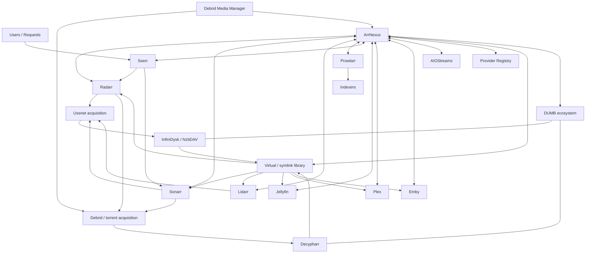

# ArrNexus v9.3.0-beta

**ArrNexus is a self-hosted control, automation and intelligence layer for Arr-based media stacks.**

It is designed to sit above and beside the specialist tools that already do their jobs well — **Radarr, Sonarr, Lidarr, Prowlarr, Seerr, Jellyfin, Plex, Emby, DUMB, NzbDAV/InfiniDysk, Decypharr, AIOStreams, Debrid Media Manager and supported Debrid/Usenet providers** — rather than replacing them.

The original project started as a DMM/Real-Debrid to Arr routing helper. It has grown into a broader operational layer for discovery, acquisition planning, provider routing, DMM imports, language validation, library health, media-server visibility, music discovery, Prowlarr control, AIOStreams configuration, diagnostics and day-to-day media operations.

> **Release line:** `9.3.0-beta`
>
> v9.3 is a beta because the new performance snapshots, media-server connectors and multi-provider workflows still need broad live-stack testing. The release validator is extensive, but it cannot reproduce every third-party service, mount namespace or network layout.

---

## What changed in v9.3

### Targeted performance work from real route timings

v9.2 also fixed a production-data Dashboard cache bug caused by trying to deep-copy non-empty `sqlite3.Row` history objects; those rows are normalised to plain dictionaries before caching and that regression remains covered in v9.3.

v9.2 added `Server-Timing`, `X-ArrNexus-Elapsed-Ms` and `slow_request` logging. Live testing showed the expensive routes were not all the same problem, so v9.3 optimises them individually rather than adding another blanket cache:

- **DMM Inbox** uses a short stale-while-revalidate snapshot and no longer performs a live Jellyfin lookup for every card during page rendering.
- **Maintenance** runs filesystem/source/link/import inventory work concurrently on worker threads and serves a reusable snapshot.
- **Problem Centre** runs namespace, broken-link and Arr health probes concurrently and uses a short snapshot.
- **Stack Readiness** runs base readiness and bounded live application probes concurrently.
- **InfiniDysk** fetches health, queue, history and native overview telemetry concurrently with bounded timeouts and reuses a per-window snapshot.
- **Music Artist** runs Lidarr library lookup, Lidarr catalogue lookup, MusicBrainz and artwork work concurrently. Optional external metadata is bounded so it cannot hold the whole page hostage indefinitely.
- **Specialist Arr matching** performs independent instance/library checks concurrently.

Normal navigation keeps the persistent app shell, request de-duplication, recently visited page cache and intent-based prefetch. v9.3 does **not** silently crawl every expensive page in the sidebar.

### Music configuration is visible again

The Music Hub now has a dedicated **Music API Settings** page for:

- Spotify application Client ID / Client Secret / redirect URI
- SoundCloud application Client ID / Client Secret
- Jamendo Client ID
- Last.fm API key

The general Settings page links to the same place, and administrators get a direct sidebar entry. External catalogue launch URLs are validated before ArrNexus renders them so placeholder/example domains are not presented as working music providers.

### More media-server choices

Jellyfin remains the deepest existing media-server integration, but v9.3 adds first-class connection/probe support for:

- **Plex Media Server** — URL plus `X-Plex-Token`
- **Emby Server** — URL plus API key
- **Jellyfin** — retained
- **Custom/external media server** — configurable URL, health path and optional bearer/header/query authentication

The custom connector is intentionally a safe HTTP health/integration foundation rather than arbitrary third-party Python execution. Deeper Plex/Emby library browsing can be added without redesigning the connection model.

### Public home is always reachable

Authenticated pages now expose an obvious **Public Home / About** route in the sidebar and a persistent home button in the top bar. Music pages also expose a direct Public Home control.

### Public documentation now covers real deployment choices

The landing page and this README describe:

1. ZIP/source deployment with Docker Compose
2. host-side validation through a Python virtual environment
3. Git clone + Docker Compose source build
4. Portainer Git-stack deployment
5. future official GitHub Container Registry image deployment
6. Portainer Web Editor / Stack-file deployment using the future official image
7. upgrades and rollback

The GHCR image examples are **templates until an official ArrNexus image is actually published**. Do not trust an unofficial container solely because it uses the ArrNexus name.

---

# What problem does ArrNexus solve?

A self-hosted media stack can be extremely capable, but each application normally understands only its own part of the workflow:

- Radarr manages movies.
- Sonarr manages TV.
- Lidarr manages music.
- Prowlarr manages indexers.
- Seerr manages requests/discovery.
- Jellyfin, Plex and Emby serve finished libraries.
- DUMB can coordinate a virtualised media ecosystem.
- NzbDAV/InfiniDysk handle Usenet-backed virtual media and telemetry.
- Decypharr handles Debrid/torrent-side workflows.
- DMM is excellent for discovering and adding content to a Debrid account.
- AIOStreams consolidates stream/addon/provider configuration for compatible clients.

The gap is a place where those systems can be **viewed, reasoned about and automated together**.

ArrNexus fills that gap. It is the **control layer**, not the final media server and not another download client.

---

# Reference architecture

You do **not** need every component below. This is the type of environment ArrNexus is designed to coordinate.



A typical normal request still looks like:

```text
Request
  -> Radarr / Sonarr / Lidarr
  -> search / acquisition decision
  -> Usenet or Debrid/provider backend
  -> virtual / linked or normal library
  -> Jellyfin / Plex / Emby
```

ArrNexus adds cross-service intelligence and visibility around that flow.

---

# Required and optional components

ArrNexus is modular. You can deploy it before most integrations are configured.

| Component | Required? | Purpose |
| --- | --- | --- |
| Docker | **Yes** for recommended deployment | Runs ArrNexus |
| Portainer | No | Convenient Git/Stack deployment |
| Radarr | Optional | Movies, searches, roots, profiles and imports |
| Sonarr | Optional | TV, season/episode state and searches |
| Lidarr | Optional | Music library/acquisition |
| Prowlarr | Optional | Indexer visibility and controls |
| Seerr | Optional | Request context |
| Jellyfin | Optional | Media-server/library integration |
| Plex | Optional | Media-server connection/health foundation |
| Emby | Optional | Media-server connection/health foundation |
| Other media servers | Optional | Generic authenticated health endpoint |
| DUMB | Optional | DUMB ecosystem/namespace awareness |
| NzbDAV / InfiniDysk | Optional | Usenet virtual media and telemetry |
| Decypharr | Optional | Debrid/torrent-side integration |
| AIOStreams | Optional | Safe full-config bridge and diagnostics |
| Debrid providers | Optional | Provider Registry / acquisition capability |
| DMM | Optional | Existing Debrid-content inbox/import workflow |
| Spotify | Optional | Per-user personal music integration |

---

# Persistent data and Portainer-first design

Normal ArrNexus configuration is stored under `/data` and managed through the browser. A normal deployment should not require a large secret-filled `.env` file.

The included Compose file is intentionally simple:

```yaml
services:
  arrnexus:
    build: .
    container_name: arrnexus
    restart: unless-stopped
    pid: host
    cap_add:
      - SYS_PTRACE
    extra_hosts:
      - "host.docker.internal:host-gateway"
    ports:
      - "8484:8000"
    volumes:
      - ./data:/data
```

`pid: host` and `SYS_PTRACE` are important in DUMB deployments where useful virtual media mounts exist inside the Arr/DUMB mount namespace rather than on the Docker host itself.

Do not remove those options simply because the host does not show `/mnt/debrid` directly.

---

# Installation method 1 — Release ZIP + Docker Compose

This is a good way to test a specific release without depending on a Git branch.

## 1. Install host tools

On Debian/Ubuntu:

```bash
sudo apt update
sudo apt install -y unzip python3-venv
```

The ArrNexus container installs its own Python dependencies. `python3-venv` is only needed if you want to execute the release validator directly on the host before building Docker.

## 2. Extract the release

```bash
unzip arrnexus-v9.3.zip
cd arrnexus-v9.3
```

## 3. Run the host-side validator

Do **not** install ArrNexus dependencies into Debian's system Python. Use a project virtual environment:

```bash
python3 -m venv .venv
source .venv/bin/activate

python -m pip install --upgrade pip
python -m pip install -r requirements.txt
python validate.py

deactivate
```

The `.venv` is local validation tooling. Docker does not use it.

## 4. Validate and build Compose

```bash
docker compose config
docker compose up -d --build
```

## 5. Confirm the service

```bash
docker compose ps
docker compose logs --tail=200 arrnexus
curl -fsS http://127.0.0.1:8484/api/health
echo
```

Then open:

```text
http://<ARRNEXUS_HOST>:8484
```

---

# Installation method 2 — Git clone + Docker Compose source build

Once the project is published on GitHub:

```bash
git clone https://github.com/<GITHUB_OWNER>/ArrNexus.git arrnexus
cd arrnexus

docker compose config
docker compose up -d --build
```

If you want the full source validation first:

```bash
python3 -m venv .venv
source .venv/bin/activate
python -m pip install --upgrade pip
python -m pip install -r requirements.txt
python validate.py
deactivate
```

To update a Git checkout later:

```bash
cd arrnexus
git pull --ff-only
docker compose up -d --build
```

Keep the persistent `data` directory intact.

---

# Installation method 3 — Portainer Git stack

For a public repository:

1. Open **Portainer → Stacks → Add stack**.
2. Name the stack `arrnexus`.
3. Choose **Git repository**.
4. Paste the ArrNexus repository HTTPS URL.
5. Choose the desired branch/tag/reference.
6. Set the Compose path to `docker-compose.yml`.
7. Deploy the stack.

Portainer clones the repository and builds the included Dockerfile.

Persistent application state remains in `./data:/data`.

For a major upgrade, back up the data directory first.

---

# Installation method 4 — Future official GHCR image

When an official GitHub Container Registry image is published, users will be able to deploy without building the source locally.

**The image name below is a template until an official package exists.**

```yaml
services:
  arrnexus:
    image: ghcr.io/<GITHUB_OWNER>/arrnexus:latest
    container_name: arrnexus
    restart: unless-stopped
    pid: host
    cap_add:
      - SYS_PTRACE
    extra_hosts:
      - "host.docker.internal:host-gateway"
    ports:
      - "8484:8000"
    volumes:
      - ./data:/data
```

Then:

```bash
docker compose pull
docker compose up -d
```

Do not pull an unofficial image simply because it uses the ArrNexus name.

---

# Installation method 5 — Portainer Web editor / Stack file

Once the official GHCR image exists, Portainer users who do not want a Git checkout can:

1. Open **Stacks → Add stack → Web editor**.
2. Paste the GHCR Compose definition above.
3. Keep `pid: host`, `SYS_PTRACE`, the `8484:8000` mapping and `./data:/data`.
4. Deploy.
5. Open `http://<ARRNEXUS_HOST>:8484`.

API keys and normal application settings should be entered through ArrNexus, not embedded in the public stack definition.

---

# Upgrading a ZIP deployment safely

Build a new version **beside** the previous version. Do not mutate the old release in place.

Example generic workflow:

```bash
cd /path/to/old-arrnexus
docker compose down

cd /path/to/releases
unzip arrnexus-v9.3.zip
mkdir -p arrnexus-v9.3/data
cp -a old-arrnexus/data/. arrnexus-v9.3/data/

cd arrnexus-v9.3
python3 -m venv .venv
source .venv/bin/activate
python -m pip install --upgrade pip
python -m pip install -r requirements.txt
python validate.py
deactivate

docker compose config
docker compose up -d --build
```

Then verify:

```bash
docker compose ps
docker compose logs --tail=200 arrnexus
curl -fsS http://127.0.0.1:8484/api/health
echo
```

Keep the old version directory intact until the new release has been live-tested.

Rollback is then simply:

```bash
cd /path/to/new-arrnexus
docker compose down

cd /path/to/old-arrnexus
docker compose up -d
```

---

# Docker networking — common mistake

A URL that works from your browser does not necessarily work from inside ArrNexus.

If services share a Docker network, container DNS names may work:

```text
http://radarr:7878
http://sonarr:8989
http://lidarr:8686
http://prowlarr:9696
```

If the service runs elsewhere, use a hostname/address reachable from the ArrNexus container.

Do not blindly use:

```text
localhost
127.0.0.1
```

Inside the ArrNexus container those point back at ArrNexus itself.

---

# First-run setup

A fresh installation opens the public ArrNexus landing page first. Private stack details are not exposed publicly.

The setup path is:

1. **Create administrator**
2. **Environment check** — Docker/PID namespace and mount awareness
3. **Connect applications**
4. **Configure providers**
5. **Review media servers**
6. **Map logical libraries/mounts**
7. **Run Stack Readiness**
8. **Finish setup and enter Dashboard**

Returning visitors can read the public About/install page without authentication, but private media/library/service data remains behind login.

---

# Connections

Open **Connections** to attach the applications you use.

## Radarr

Used for movie metadata, root folders, searches, quality context and import state.

## Sonarr

Used for TV metadata, season/episode state, interactive release search and TV pack planning.

ArrNexus searches real seasons using `seriesId + seasonNumber` rather than pretending one `seriesId` query is a complete-series release search.

## Lidarr

Used for music library management and final music acquisition.

## Prowlarr

Used for indexer visibility and supported settings such as enabled state, priority, RSS, automatic search and interactive search.

Be careful in DUMB-managed environments: an external manager may intentionally restore routing-sensitive settings.

## Seerr

Provides request/discovery context.

## Jellyfin

The deepest current media-server integration, including library/search context used throughout ArrNexus.

## Plex

v9.3 accepts a Plex server URL plus `X-Plex-Token` and verifies the Plex server endpoint. This is the foundation for deeper library integration in later releases.

## Emby

v9.3 accepts an Emby server URL plus API key and verifies the protected system-info API.

## Custom media server

Use the external-media-server form when another server exposes a useful HTTP health/API endpoint. Configure:

- Name
- Base URL
- Health path
- Authentication mode: none / bearer / header / query
- Header/query name when applicable
- Secret

This is a bounded HTTP connector, not arbitrary plugin code.

---

# DUMB, mount namespaces and virtual media

Some DUMB/Arr deployments expose useful mounts inside a process mount namespace while the Docker host itself does not have the same path mounted normally.

ArrNexus can follow the live Arr/DUMB namespace using host PID visibility. Conceptually:

```text
/proc/<ARR_PID>/root/<logical-media-path>
```

That is why the recommended Compose keeps:

```yaml
pid: host
cap_add:
  - SYS_PTRACE
```

Do not "fix" a working deployment by assuming the virtual-media path must exist directly on the host.

Three concepts should remain separate:

1. **Source content** — Usenet/Debrid-backed source
2. **Virtual/cache layer** — NzbDAV/Decypharr/DUMB exposure
3. **Managed library** — the path seen by Radarr/Sonarr/Lidarr/media server

ArrNexus reasons about the relationship rather than blindly moving source content.

---

# DMM / Debrid Inbox

This workflow originally drove the project.

```text
DMM / provider content
  -> ArrNexus identifies source
  -> movie/TV match
  -> route + quality + language checks
  -> owning Arr item
  -> managed link/import
  -> media server sees normal library result
```

Features include:

- movie/TV identification
- route suggestions
- duplicate grouping
- already-linked/imported state
- explicit bulk routing
- import jobs/failure reasons
- safe symlink mode and Undo
- broken-link scanning/repair
- orphan detection
- Quality Lab comparison
- routing rules and learn-from-corrections foundations
- Language Guard

Undo focuses on ArrNexus-created library links. It is not designed to delete the underlying Debrid/DMM source.

---

# Language Guard

Release filenames are not reliable proof of actual streams.

ArrNexus includes `ffmpeg`/`ffprobe` in the image and can inspect real audio/subtitle metadata.

The default policy can require:

- English audio
- English subtitles
- fail closed when stream language metadata is unknown

A non-compliant DMM/Debrid source is **not destructively deleted**. ArrNexus can keep the source untouched and trigger replacement/upgrade search through the owning Arr application.

---

# Acquisition strategies

Current strategies include:

- **Automatic**
- **Debrid first → Usenet fallback**
- **Usenet first → Debrid fallback**
- **Debrid only**
- **Usenet only**
- **Fastest / cached provider preference**
- **Best quality / score**

ArrNexus plans and orchestrates; the owning Arr application still hands work to its configured download/acquisition clients.

---

# Provider Registry

ArrNexus is no longer designed around Real-Debrid as the only possible provider.

The Provider Registry can represent services such as:

- Real-Debrid
- TorBox
- Premiumize
- AllDebrid
- Debrid-Link
- EasyDebrid
- Debrider
- Offcloud
- Put.io
- PikPak
- Seedr
- Easynews
- NzbDAV / InfiniDysk
- AltMount
- StremThru Newz
- AIOStreams
- Torrin
- other supported/manual capability definitions

Credentials are stored in persistent state and masked in the UI.

---

# AIOStreams Bridge

AIOStreams is optional. Stremio is not required to use the rest of ArrNexus.

When configured, ArrNexus uses a deliberately conservative full-config workflow:

```text
GET current userData
  -> calculate digest
  -> masked preview
  -> user confirms
  -> GET/re-check digest
  -> private pre-write backup
  -> merge only known ArrNexus integrations
  -> full PUT
  -> verify
```

Because AIOStreams user PUT is a full replacement operation, ArrNexus preserves unrelated settings and refuses Apply when the remote config changed after Preview.

Rollback itself first backs up the current remote configuration.

Search diagnostics redact playback URLs, Authorization/Cookie values, proxy/request headers and secret-bearing fields.

---

# Music Hub

Music is a first-class workflow rather than forcing it into movie/TV screens.

Supported/open/optional catalogue integrations include:

- ListenBrainz
- Apple / iTunes
- Audius
- MusicBrainz
- Deezer
- Internet Archive
- Jamendo
- SoundCloud
- Spotify
- Last.fm
- external catalogue launchers such as Amazon Music, Beatport, Bandcamp and Discogs

Sources are labelled honestly. Global ListenBrainz trends are not presented as Spotify trends.

## Music API Settings

Administrators can open:

```text
Music Hub -> Music API Settings
```

or the dedicated Settings navigation entry.

This is where application/API credentials for Spotify, SoundCloud, Jamendo and Last.fm live.

## Spotify personal account

Spotify application credentials provide catalogue access. A separate per-ArrNexus-user OAuth flow can expose:

- saved tracks
- saved albums
- playlists
- top tracks
- top artists
- recently played tracks

The registered Spotify callback URI must exactly match the URI ArrNexus uses. Normal remote deployments should use HTTPS.

The ultimate music acquisition path remains Lidarr → Prowlarr → configured Usenet/provider workflow.

---

# Feature guide

## Dashboard

Fast operational overview using a reusable snapshot rather than synchronously rescanning the entire stack on every click.

## Discover

Cross-service media discovery and acquisition planning.

## DMM Inbox / Item Review

Review provider/DMM sources, route them, inspect language/quality state and link safely into managed libraries.

## Download Queue / Acquisition

See active work and acquisition decision trails across supported backends.

## Music Hub

Provider-specific discovery, Spotify personal data and Lidarr handoff.

## Indexers

Prowlarr-backed indexer status and supported settings.

## Libraries

Logical mount/library relationships and managed media structure.

## Routing Rules

Route default/specialist libraries without one universal target.

## Quality Lab

Release scoring with explainable reasons.

## Self-Healing

Detect missing/upgrade/broken conditions and trigger bounded remediation.

## InfiniDysk

Native overview telemetry, queue/history and selectable time windows where upstream support is configured.

## Providers

Provider capabilities and secret-safe configuration.

## AIOStreams

Safe bridge, preview/apply/backup/rollback and redacted diagnostics.

## Problem Centre

Focused fault queue instead of hunting across applications.

## Maintenance

Backups, broken-link/orphan scanning, diagnostics and safe housekeeping.

## Stack Readiness

Bounded live verification for the applications and infrastructure that matter to the current deployment.

## Unified Logs

Searchable ArrNexus events plus `performance / slow_request` entries for routes exceeding the configured threshold.

## Connections

Radarr/Sonarr/Lidarr/Prowlarr/Seerr/Jellyfin/Plex/Emby and custom external media-server configuration.

---

# Performance model

ArrNexus deliberately avoids doing all expensive work on every navigation.

Current architecture includes:

- DUMB process discovery caching
- DMM source inventory caching
- source → symlink index caching
- library inventory caching
- dashboard snapshot/background refresh
- stale-while-revalidate snapshots for expensive operational pages
- concurrent external API calls with short/bounded timeouts
- persistent client shell
- recently visited page cache
- request de-duplication
- intent-based prefetch
- route timing headers/logging

A slow request produces a log event similar to:

```text
source: performance
event: slow_request
GET /some-route took 4200ms
```

Use those logs to identify the specific remaining bottleneck rather than assuming the entire application needs another cache.

---

# Public homepage and release download

`/` is deliberately public and contains product/install documentation without private stack data.

Private routes such as `/dashboard` require authentication.

A running ArrNexus build can expose a clean source-only release export at:

```text
/download/latest
/download/latest.sha256
/api/public/release
```

The release exporter excludes persistent data, databases, backups, `.env`, virtualenvs, bytecode, runtime caches and existing archives.

---

# Security model

Important rules:

- API keys/tokens/passwords are stored as secret settings and masked on screen.
- Public documentation contains no deployment-specific secrets.
- diagnostic/release exports intentionally exclude or sanitise private data.
- AIOStreams writes use preview, stale protection, backup and verification.
- Language Guard does not delete the original DMM/provider source.
- Undo focuses on ArrNexus-created links.
- custom media-server connectors are data/config driven HTTP checks, not arbitrary Python execution.
- destructive operations should stay explicit, bounded and reviewable.

If a credential appears in UI, logs, a diagnostic bundle or release export, treat it as a security bug.

---

# Validation

From a source release:

```bash
python3 -m venv .venv
source .venv/bin/activate
python -m pip install --upgrade pip
python -m pip install -r requirements.txt
python validate.py
deactivate
```

v9.3's validator executes the previous regression chain first:

```text
v9.3
 -> v9.2
    -> v9.1
       -> v9
          -> v8
             -> v7
```

Then v9.3 adds tests for the new music, media-server, performance and documentation behaviour.

See `VALIDATION.md` for the exact release record.

Docker image build validation must be performed in an environment where Docker is available; a validator PASS does not pretend third-party services are live.

---

# Troubleshooting

## Connector fails

1. Open **Connections**.
2. Confirm URL is reachable **from the ArrNexus container**.
3. Do not use `localhost` for another container.
4. Verify the API key/token belongs to the correct service.
5. Check Docker network/DNS/routing.
6. Open **Unified Logs**.

## A page is slow

Open **Unified Logs** and filter:

```text
performance
```

or:

```text
slow_request
```

The route and measured server time will be logged.

## Music provider opens a wrong/placeholder page

Check **Music API Settings** and any installed catalogue-provider JSON. ArrNexus rejects known example/placeholder domains, but a real plugin must still contain the correct provider URL.

## ArrNexus fails to start

```bash
docker compose ps
docker compose logs --tail=300 arrnexus
```

## Host validator says FastAPI is missing

That means the Debian host Python does not contain application dependencies. Use the virtualenv procedure above:

```bash
python3 -m venv .venv
source .venv/bin/activate
python -m pip install -r requirements.txt
python validate.py
```

Do not install application packages directly into protected Debian system Python merely to run the validator.

---

# Beta testing and feedback

Useful reports include:

- exact ArrNexus version
- deployment method
- which integrations are enabled
- exact route/page/action
- reproducible steps
- sanitised logs
- `slow_request` timing when relevant
- expected result
- actual result

Remove credentials, hostnames/IPs, local usernames and sensitive filesystem information before publishing screenshots or logs.

---

# Project direction

ArrNexus is being developed as the layer that connects the gaps between otherwise excellent self-hosted media applications.

The goal is not to own every component. The goal is to make the existing stack **easier to understand, safer to change, easier to operate together and easier to automate**.
